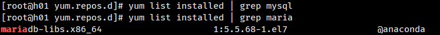
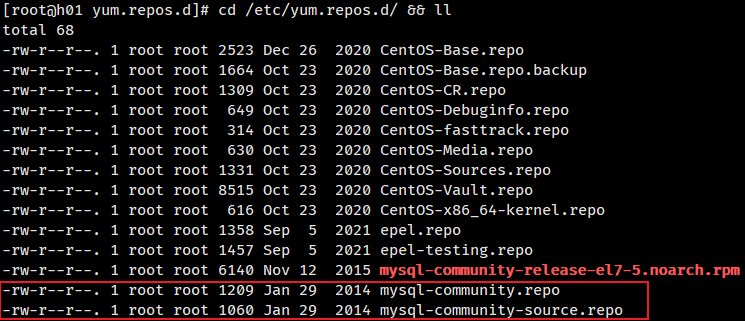
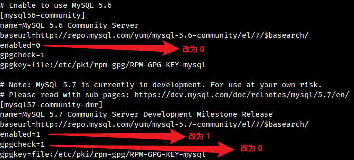
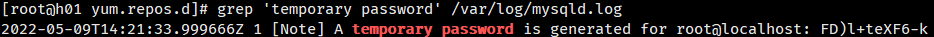
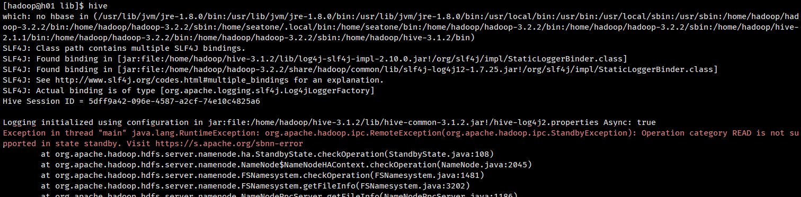
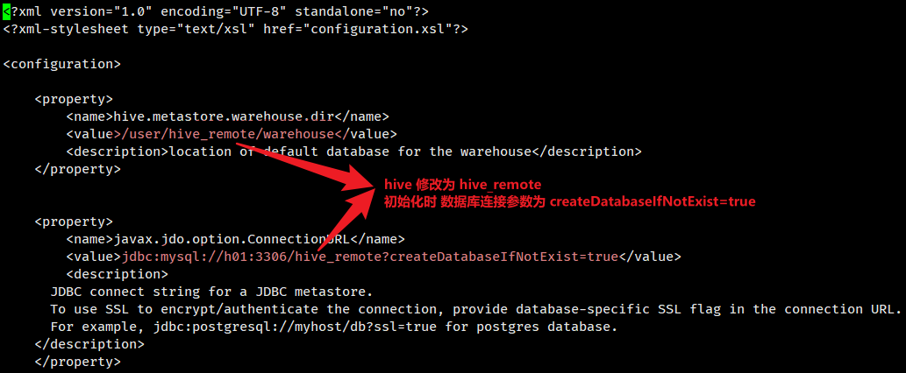
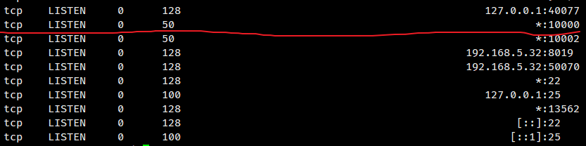
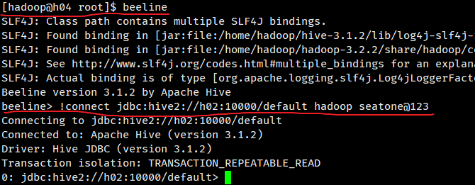

# 一、Hive 集群快速安装（hiveserver 集成 metastore）

## 规划

| 主机节点     | 配置                  |
| ------------ | --------------------- |
| 192.168.5.37 | ~~hiveserver~~、mysql |
| 192.168.5.31 | hiveserver-metastore  |
| 192.168.5.34 | hiveserver-client     |


## 1.1 安装 MySQL

1. ##### 修改 源

   ```
   # 下载 wget 工具
   yum -y install wget
   
   # 看一下默认的yum源
   cd /etc/yum.repos.d/ && ll
   
   # 备份原来的yum源
   mv /etc/yum.repos.d/CentOS-Base.repo /etc/yum.repos.d/CentOS-Base.repo.backup
   
   # 下载新的 CentOS-Base.repo 到 /etc/yum.repos.d/
   wget -O /etc/yum.repos.d/CentOS-Base.repo https://mirrors.aliyun.com/repo/Centos-7.repo
   
   # 更新缓存
   yum clean all && yum makecache
   ```

2. #####  查看原有 mysql 

   ```
   # 查看系统原有的MySQL和MariaDB
   yum list installed | grep mysql
   yum list installed | grep maria
   ```

    

   ##### 如果有，执行卸载

   ```
   yum -y remove mariadb-libs-5.5.68-1.el7.x86_64
   ```

3. #####  给CentOS添加rpm源，并且选择较新的源

   ```
   wget dev.mysql.com/get/mysql-community-release-el7-5.noarch.rpm
   ```

4. ##### 安装下载好的rpm文件

   ```
   yum install mysql-community-release-el7-5.noarch.rpm -y
   ```

   ```
   cd /etc/yum.repos.d/ && ll
   ```

    

5. ##### 修改mysql-community.repo文件

   ```
   vi /etc/yum.repos.d/mysql-community.repo
   ```

    

6. ##### 使用yum安装mysql

   ```
   # yum install mysql-server -y
   yum install mysql-community-server
   ```

7. ##### 启动服务，并设置开机启动

   ```
   #启动之前需要生成临时密码，需要用到证书，可能证书过期，需要进行更新操作
   yum update -y
   
   #启动mysql服务
   service mysqld start
   
   #设置mysql开机启动
   systemctl enable mysqld.service
   chkconfig mysqld on
   ```

8. #####  查看mysql服务是否启动成功

   ```
   ps -ef|grep mysql
   ```

9. ##### 修改密码

   ```
   # 查询MySQL的临时密码
   grep 'temporary password' /var/log/mysqld.log
   ```

    

10. ##### 复制临时密码，然后登录MySQL

    ```css
    mysql -uroot -p
    ```

11. ##### 修改密码

    ```
    #　mysql中初始密码长度为8，当你更改MySQL密码策略后
    set global validate_password_policy=0;
    
    # 修改用户密码
    ALTER USER 'root'@'localhost' IDENTIFIED BY 'seatone@123';
    ```

    ```
    # 刷新权限
    flush privileges;
    ```

12. ##### 添加 root 授权用户，允许外网访问

    ```
    # 授权
    grant all privileges on *.* to 'root'@'%' identified by 'seatone@123' with grant option;
    
    # 指定数据库
    use mysql;
    
    # 删除其他用户
    delete from user where host != '%';
    
    # 刷新权限
    flush privileges;
    ```

13. 修改回 yum 源（可以不修改）

    ```
    mv /etc/yum.repos.d/CentOS-Base.repo.backup /etc/yum.repos.d/CentOS-Base.repo
    
    # 更新缓存
    yum clean all && yum makecache
    ```

## 1.2 下载 Hive 

apache-hive-3.1.2-bin.tar.gz

https://mvnrepository.com/artifact/mysql/mysql-connector-java/5.1.49

## 1.3 解压 Hive 数据

```
# 解压 hive
tar -zxvf apache-hive-3.1.2-bin.tar.gz

# 重命名
mv apache-hive-3.1.2-bin hive-3.1.2
```

## 1.4 配置 Hive （单机）

### hive-site.xml 配置

```
cd /home/hadoop/hive-3.1.2/conf

touch hive-site.xml

vi hive-site.xml
```

```
<?xml version="1.0" encoding="UTF-8" standalone="no"?>
<?xml-stylesheet type="text/xsl" href="configuration.xsl"?>

<configuration>

    <property>
        <name>hive.metastore.warehouse.dir</name>
        <value>/user/hive/warehouse</value>
        <description>location of default database for the warehouse</description>
    </property>

    <property>
        <name>javax.jdo.option.ConnectionURL</name>
        <value>jdbc:mysql://h01:3306/hive?useSSL=false</value>
        <description>
      JDBC connect string for a JDBC metastore.
      To use SSL to encrypt/authenticate the connection, provide database-specific SSL flag in the connection URL.
      For example, jdbc:postgresql://myhost/db?ssl=true for postgres database.
    </description>
    </property>

    <property>
        <name>javax.jdo.option.ConnectionDriverName</name>
        <value>com.mysql.jdbc.Driver</value>
        <description>Driver class name for a JDBC metastore</description>
    </property>

    <property>
        <name>javax.jdo.option.ConnectionUserName</name>
        <value>root</value>
        <description>db user</description>
    </property>

    <property>
        <name>javax.jdo.option.ConnectionPassword</name>
        <value>seatone@123</value>
        <description>db ConnectionPassword</description>
    </property>

    <!-- Hive元数据存储的验证 -->
    <property>
        <name>hive.metastore.schema.verification</name>
        <value>false</value>
    </property>
   
    <!-- 元数据存储授权  -->
    <property>
        <name>hive.metastore.event.db.notification.api.auth</name>
        <value>false</value>
    </property>

</configuration>
```

### 环境变量配置

```
vi /etc/profile
```

文件末尾追加

```
# hive
export HIVE_HOME=/home/hadoop/hive-3.1.2


export PATH=$PATH:$HIVE_HOME/bin
```

## 1.5 初始化 Hive

```
schematool -dbType mysql -initSchema
```

### 初始化报错处理

1. ##### 提示 common jar 包参数错误，原因为 与 hadoop guava jar 包冲突，替换低版本 jar 包即可

   ```
   # 进入 hive 包
   cd /home/hadoop/hive-3.1.2/lib
   
   # 备份 hive guava jar 包
   mv guava-19.0.jar guava-19.0.jar.back
   
   # 使用 hadoop guava jar 包
   cp /home/hadoop/hadoop-3.2.2/share/hadoop/common/lib/guava-27.0-jre.jar .
   ```

2. ##### 提示 无法连接数据库

   检查配置文件 数据库相关配置

## 1.5 启动 Hive

```
hive
```

### hive 命令启动报错（hdfs 节点 standby）

 

解决方法

查看 hdfs 节点状态

```
hdfs haadmin -getServiceState nn1
hdfs haadmin -getServiceState nn2
```

切换节点状态

```
# 将 active 状态从 nn2 节点切换到 nn1 上
hdfs haadmin -failover nn2 nn1
```

# 二、Hive 元数据服务、Client搭建（通过 client 连接 metastore 访问）

## 2.1 发送 h01(192.168.5.37) hive安装包

```
su hadoop
cd ~
scp -r hive-3.1.2/ hadoop@h04:~/
scp -r hive-3.1.2/ hadoop@h02:~/
```

## 2.2 配置 /etc/profile(h04,h02)

```
sudo vi /etc/profile
```

文件末尾追加

```
# hive
export HIVE_HOME=/home/hadoop/hive-3.1.2

export PATH=$PATH:$HIVE_HOME/bin
```

```
source /etc/profile
```

## 2.3 配置 hive-metastore(h04)

```
# 节点 192.168.5.31
vi hive-3.1.2/conf/hive-site.xml
```

 

## 2.4 配置 hive-client(h02)

```
# 节点 192.168.5.32
vi hive-3.1.2/conf/hive-site.xml
```

文件内容替换为下列信息：

```
<?xml version="1.0" encoding="UTF-8" standalone="no"?>
<?xml-stylesheet type="text/xsl" href="configuration.xsl"?>

<configuration>

    <property>
        <name>hive.metastore.uris</name>
        <value>thrift://h04:9083</value>
    </property>

	<property>
        <name>hive.metastore.warehouse.dir</name>
        <value>/user/hive_remote/warehouse</value>
    </property>

</configuration>
```

## 2.5 初始化 hive-metastore(h04)

```
# 初始化
schematool -dbType mysql -initSchema

# 启动
hive --service metastore
# 后台启动
nohup hive --service metastore &
```

> 前台启动的方式导致需要打开多个shell窗口，可以使用如下方式后台方式启动
>
> nohup: 放在命令开头，表示不挂起,也就是关闭终端进程也继续保持运行状态
>
> 0:标准输入
>
> 1:标准输出
>
> 2:错误输出
>
> 2>&1 : 表示将错误重定向到标准输出上
>
> &: 放在命令结尾,表示后台运行
>
> 一般会组合使用: nohup [xxx命令操作]> file 2>&1 & ， 表示将xxx命令运行的
>
> 结果输出到file中，并保持命令启动的进程在后台运行。

```
# 后台启动
nohup hive --service metastore 2>&1 &
```


## 2.6 启动 hive-client(h02)，用户连接

```
hive
```

## 2.6 启动 hive-server2(h02) ，应用程序连接

```
#　前台
hive --service hiveserver2
#　后台
hive --service hiveserver2 &
```

```
# 查看 hive-server2 占用端口
ss -nal
```

 

## 2.7 beelne 连接 hive-server2（h04）

```
beeline
```

```
!connect jdbc:hive2://h02:10000/default hadoop seatone@123
```

 


