# 一、Hive

## 简介

### 概念

-    从概念上讲：由Facebook开源的一款基于hadoop的用于统计海量结构化数据的一个数据仓库。
-   从本质上讲：将HQL语句转换成MapReduce程序的一个工具。

Hive：**数据仓库**

- 数据不可修改
- 容纳不同数据源数据，且可以保留历史版本（时间拉链表、面向主题）
- 只做分析，尽快返回结果

Hive：解释器，编译器，优化器等

Hive：运行时，元数据存储在关系型数据库里面

### 产生：

- 让了方便非java开发人员对hdfs上的数据做 MapReduce 操作

## 架构

1. 从客户端编辑 sql 语句提交到服务端，通过解释器，编译器，优化器生成执行计划，然后提交到 Hadoop 集群运行

>  其中计划执行的最小单元是一个个 operator，每个operator代表一个操作或者一个MR作业


1. Hive的元数据依赖于[关系型数据库](https://cloud.tencent.com/product/cdb-overview?from=10680)，其真实数据是存在于Hadoop之上的

2.  下图为 Hive 架构简图

   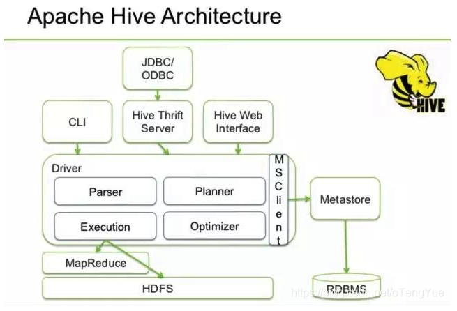 

   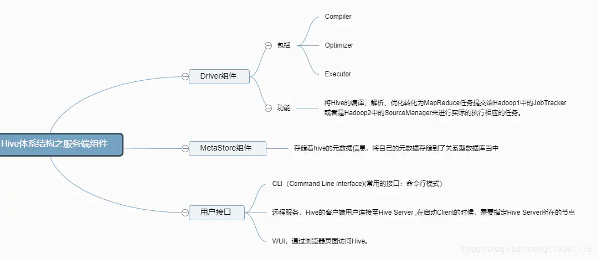 


OLTP	联机事务数据分析


**内部表** (Table 将数据保存到Hive 自己的数据仓库目录中：/usr/hive/warehouse)

**外部表** (External Table 相对于内部表，数据不在自己的数据仓库中，只保存数据的元信息)

**分区表** (Partition Table将数据按照设定的条件分开存储，提高查询效率，分区-----> 目录)

**桶表** (Bucket Table本质上也是一种分区表，类似 hash 分区 桶 ----> 文件)

**视图表** (视图表是一个虚表，不存储数据，用来简化复杂的查询)

```undefined
注意:内部表删除表后数据也会删除，外部表数据删除后不会从hdfs中删除
```


OLTP	联机事务数据分析

OLAP	联机数据仓库分析

​	上卷、下钻、旋转、切块、切片


# 二、Hive 数据操作

## 2.1 演示

```
show databases;
```

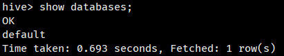 

```
show tables;
```

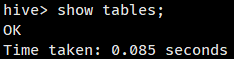 

```
create table my_user(id int, name string, age int);
```

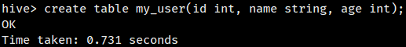 

```
insert into my_user values(1, 'zhangsan', 35);
```

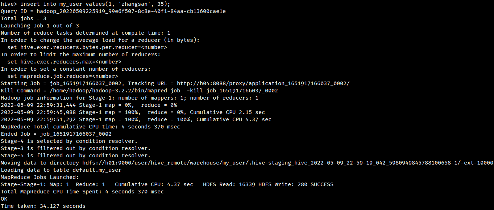 

```
select * from my_user;
```

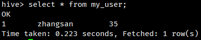 

## 2.2 建表语句

Hive 默认创建 内部表

```
CREATE [TEMPORARY] [EXTERNAL] TABLE [IF NOT EXISTS] [db_name.]table_name    -- (Note: TEMPORARY available in Hive 0.14.0 and later)
  [(col_name data_type [column_constraint_specification] [COMMENT col_comment], ... [constraint_specification])]
  [COMMENT table_comment]
  [PARTITIONED BY (col_name data_type [COMMENT col_comment], ...)]
  [CLUSTERED BY (col_name, col_name, ...) [SORTED BY (col_name [ASC|DESC], ...)] INTO num_buckets BUCKETS]
  [SKEWED BY (col_name, col_name, ...)                  -- (Note: Available in Hive 0.10.0 and later)]
     ON ((col_value, col_value, ...), (col_value, col_value, ...), ...)
     [STORED AS DIRECTORIES]
  [
   [ROW FORMAT row_format] 
   [STORED AS file_format]
     | STORED BY 'storage.handler.class.name' [WITH SERDEPROPERTIES (...)]  -- (Note: Available in Hive 0.6.0 and later)
  ]
  [LOCATION hdfs_path]
  [TBLPROPERTIES (property_name=property_value, ...)]   -- (Note: Available in Hive 0.6.0 and later)
  [AS select_statement];   -- (Note: Available in Hive 0.5.0 and later; not supported for external tables)
 
CREATE [TEMPORARY] [EXTERNAL] TABLE [IF NOT EXISTS] [db_name.]table_name
  LIKE existing_table_or_view_name
  [LOCATION hdfs_path];
 
data_type
  : primitive_type
  | array_type  -- 数组
  | map_type	-- 键值对
  | struct_type	-- 结构体
  | union_type  -- (Note: Available in Hive 0.7.0 and later)
 
primitive_type
  : TINYINT
  | SMALLINT
  | INT
  | BIGINT
  | BOOLEAN
  | FLOAT
  | DOUBLE
  | DOUBLE PRECISION -- (Note: Available in Hive 2.2.0 and later)
  | STRING
  | BINARY      -- (Note: Available in Hive 0.8.0 and later)
  | TIMESTAMP   -- (Note: Available in Hive 0.8.0 and later)
  | DECIMAL     -- (Note: Available in Hive 0.11.0 and later)
  | DECIMAL(precision, scale)  -- (Note: Available in Hive 0.13.0 and later)
  | DATE        -- (Note: Available in Hive 0.12.0 and later)
  | VARCHAR     -- (Note: Available in Hive 0.12.0 and later)
  | CHAR        -- (Note: Available in Hive 0.13.0 and later)
 
array_type
  : ARRAY < data_type >
 
map_type
  : MAP < primitive_type, data_type >
 
struct_type
  : STRUCT < col_name : data_type [COMMENT col_comment], ...>
 
union_type
   : UNIONTYPE < data_type, data_type, ... >  -- (Note: Available in Hive 0.7.0 and later)
 
row_format	-- 分隔符，自己指定分隔符
  : DELIMITED [FIELDS TERMINATED BY char [ESCAPED BY char]] [COLLECTION ITEMS TERMINATED BY char]
        [MAP KEYS TERMINATED BY char] [LINES TERMINATED BY char]
        [NULL DEFINED AS char]   -- (Note: Available in Hive 0.13 and later)
  | SERDE serde_name [WITH SERDEPROPERTIES (property_name=property_value, property_name=property_value, ...)]
 
file_format:
  : SEQUENCEFILE
  | TEXTFILE    -- (Default, depending on hive.default.fileformat configuration)
  | RCFILE      -- (Note: Available in Hive 0.6.0 and later)
  | ORC         -- (Note: Available in Hive 0.11.0 and later)
  | PARQUET     -- (Note: Available in Hive 0.13.0 and later)
  | AVRO        -- (Note: Available in Hive 0.14.0 and later)
  | JSONFILE    -- (Note: Available in Hive 4.0.0 and later)
  | INPUTFORMAT input_format_classname OUTPUTFORMAT output_format_classname
 
column_constraint_specification:
  : [ PRIMARY KEY|UNIQUE|NOT NULL|DEFAULT [default_value]|CHECK  [check_expression] ENABLE|DISABLE NOVALIDATE RELY/NORELY ]
 
default_value:
  : [ LITERAL|CURRENT_USER()|CURRENT_DATE()|CURRENT_TIMESTAMP()|NULL ] 
 
constraint_specification:
  : [, PRIMARY KEY (col_name, ...) DISABLE NOVALIDATE RELY/NORELY ]
    [, PRIMARY KEY (col_name, ...) DISABLE NOVALIDATE RELY/NORELY ]
    [, CONSTRAINT constraint_name FOREIGN KEY (col_name, ...) REFERENCES table_name(col_name, ...) DISABLE NOVALIDATE 
    [, CONSTRAINT constraint_name UNIQUE (col_name, ...) DISABLE NOVALIDATE RELY/NORELY ]
    [, CONSTRAINT constraint_name CHECK [check_expression] ENABLE|DISABLE NOVALIDATE RELY/NORELY ]
```

```
# 分隔符
create table my_psn
(
id int, 
name string, 
likes array<string>,
address map<string, string>
)
row format delimited
fields terminated by ','
collection items terminated by '-'
map keys terminated by ':';

# 分隔符
create table my_psn1
(
id int, 
name string, 
likes array<string>,
address map<string, string>
)
row format delimited
fields terminated by '\001'
collection items terminated by '\002'
map keys terminated by '\003';
```

## 2.3 数据导入

```
LOAD DATA LOCAL INPATH '/home/hadoop/hive_test.txt' OVERWRITE INTO TABLE my_psn;
```

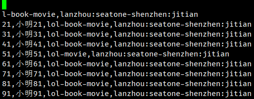 

```
hdfs dfs -put hive_test2.txt /user/hive_remote/warehouse/my_psn
```

```
select * from my_psn;
```

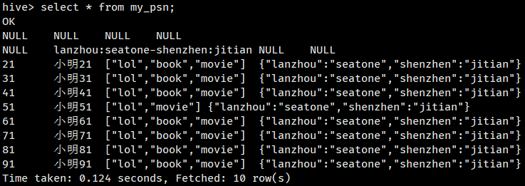 

## 2.4 内部表与外部表

```
hdfs dfs -mkdir -p /shx/data
hdfs dfs -ls /
```

```
# 外部表
create external table my_psn1
(
id int, 
name string, 
likes array<string>,
address map<string, string>
)
row format delimited
fields terminated by ','
collection items terminated by '-'
map keys terminated by ':'
location '/shx/data';
```

txt文件、csv文件

```
load data local inpath '/home/hadoop/hive_test2.txt' into table my_psn1;
```

```
select * from my_psn1;
```

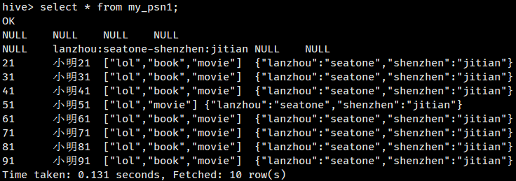 

 **外部表删除后，hdfs 中数据依然存在。**

使用场景（公司场景）：

内部表：先建表，后添加数据

外部表：添加数据/表，之后映射表/数据（外部表用的较多，先采集数据，后进行分析）

## 2.5 Hive 分区

需求：分析 2019年11月-12月数据

分区存放数据，提高检索效率

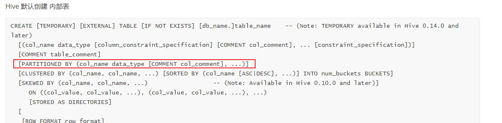    

```
# 分区表
create table my_psn2
(
id int, 
name string, 
likes array<string>,
address map<string, string>
)
partitioned by(gender string)
row format delimited
fields terminated by ','
collection items terminated by '-'
map keys terminated by ':';
```

```
load data local inpath '/home/hadoop/hive_test1.txt' into table my_psn2 partition(gender='man');
```

```
select * from my_psn2;
```

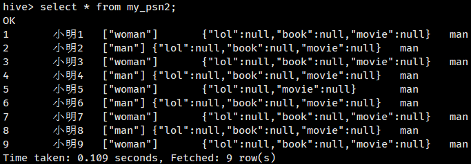 

```
# 分区表
create table my_psn3
(
id int, 
name string, 
likes array<string>,
address map<string, string>
)
partitioned by(gender string, age int)
row format delimited
fields terminated by ','
collection items terminated by '-'
map keys terminated by ':';
```

```
load data local inpath '/home/hadoop/hive_test3.txt' into table my_psn3 partition(gender='woman', age=2);
```

```
select * from my_psn3;
```

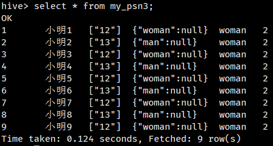 

修改分区表

添加分区表信息是必须添加所有分区字段

```
alter table my_psn3 add partition(gender='girl',age=13);
```

删除分区（分区下所有信息全部删除）

```
alter table my_psn3 drop partition(gender='girl');
```

**上述分区插入方式不灵活**

## 2.6 动态分区

当数据进入 hive 的时候，需要根据数据的某一个字段向 hive 表插入数据，此时无法满足需求，需要动态分区

测试：先创建 hdfs 文件，之后创建外部表，最后修复分区

上传数据

```
hdfs dfs -put hive_test3.txt /shx/age=10/
hdfs dfs -put hive_test3.txt /shx/age=20/
```

创建外部表

```
# 外部表
create external table my_psn7
(
id int, 
name string, 
gender string,
likes array<string>,
address map<string, string>
)
partitioned by(age int)
row format delimited
fields terminated by ','
collection items terminated by '-'
map keys terminated by ':'
location '/shx';
```

修复分区信息

```
msck repair table my_psn7;
```

报错 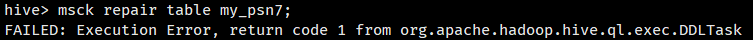 


