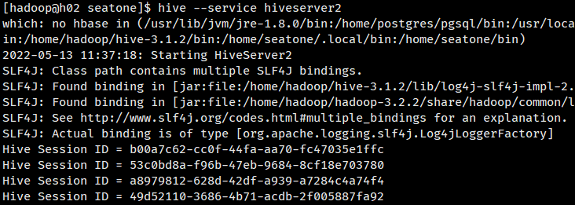

# 一、Hive

## 简介

### 概念

-    从概念上讲：由Facebook开源的一款基于hadoop的用于统计海量结构化数据的一个数据仓库。
-   从本质上讲：将HQL语句转换成MapReduce程序的一个工具。

Hive：**数据仓库**

- 数据不可修改
- 容纳不同数据源数据，且可以保留历史版本（时间拉链表、面向主题）
- 只做分析，尽快返回结果

Hive：解释器，编译器，优化器等

Hive：运行时，元数据存储在关系型数据库里面

### 产生：

- 让了方便非java开发人员对hdfs上的数据做 MapReduce 操作

## 架构

1. 从客户端编辑 sql 语句提交到服务端，通过解释器，编译器，优化器生成执行计划，然后提交到 Hadoop 集群运行

>  其中计划执行的最小单元是一个个 operator，每个operator代表一个操作或者一个MR作业


1. Hive的元数据依赖于[关系型数据库](https://cloud.tencent.com/product/cdb-overview?from=10680)，其真实数据是存在于Hadoop之上的

2.  下图为 Hive 架构简图

    

    

**内部表** (Table 将数据保存到Hive 自己的数据仓库目录中：/usr/hive/warehouse)

**外部表** (External Table 相对于内部表，数据不在自己的数据仓库中，只保存数据的元信息)

**分区表** (Partition Table将数据按照设定的条件分开存储，提高查询效率，分区-----> 目录)

**桶表** (Bucket Table本质上也是一种分区表，类似 hash 分区 桶 ----> 文件)

**视图表** (视图表是一个虚表，不存储数据，用来简化复杂的查询)

```undefined
注意:内部表删除表后数据也会删除，外部表数据删除后不会从hdfs中删除
```


OLTP	联机事务数据分析

OLAP	联机数据仓库分析

​	上卷、下钻、旋转、切块、切片


## Hive SQL的编译

 

Hive是如何将SQL转化为MapReduce任务的，整个编译过程分为六个阶段：

(1)Antlr定义SQL的语法规则，完成SQL词法，语法解析，将SQL转化为抽象语法树AST Tree

(2)遍历AST Tree，抽象出查询的基本组成单元QueryBlock

(3)遍历QueryBlock，翻译为执行操作树OperatorTree

(4)逻辑层优化器进行OperatorTree变换，合并不必要的ReduceSinkOperator，减少shuffle数据量

(5)遍历OperatorTree，翻译为MapReduce任务

(6)物理层优化器进行MapReduce任务的变换，生成最终的执行计划

## Hive执行计划

 

## Hive文件压缩和文件存储

hive对文件的压缩是对内容的压缩，也就是说对文件的压缩不是先生成文件，再对文件压缩，而是在生成文件时，对其中的内容字段进行压缩，最终压缩后，对外仍体现为某种具体的压缩文件。

**常用的压缩编解码器如下表：**

 

常用的文件格式：
（1） Textfile

>  文本格式，Hive的默认格式，数据不压缩，磁盘开销大、数据解析开销大。可结合Gzip、Bzip2使用，但使用Gzip这种方式，hive不会对数据进行切分，从而无法对数据进行并行操作。行式存储
> 对应的hive API为：org.apache.hadoop.mapred.TextInputFormat和org.apache.hive.ql.io.HiveIgnoreKeyTextOutputFormat

（2）SequenceFile

> Hadoop提供的一种二进制文件格式是Hadoop支持的标准文件格式（其他生态系统并不适用），可以直接将对序列化到文件中,所以sequencefile文件不能直接查看，可以通过Hadoop fs -text查看。具有使用方便，可分割，可压缩，可进行切片。压缩支持NONE, RECORD, BLOCK(优先)等格式，可进行切片。行式存储
> 对应hive API为：org.apache.hadoop.mapred.SequenceFileInputFormat和org.apache.hadoop.hive.ql.io.HiveSequenceFileOutputFormat

（3）RCFile

>  是一种行列存储相结合的存储方式，先将数据按行进行分块再按列式存储，保证同一条记录在一个块上，避免读取多个块，有利于数据压缩和快速进行列存储。列式存储
> 对应的hive API为：org.apache.hadoop.hive.ql.io.RCFileInputFormat和org.apache.hadoop.hive.ql.io.RCFileOutputFormat

（4）ORCFile

> orcfile是对rcfile的优化，可以提高hive的读写、数据处理性能，提供更高的压缩效率（目前主流选择之一）。列式存储

（5）Parquet

> 一种列格式, 可提供对其他 hadoop 工具的可移植性, 包括Hive, Drill, Impala, Crunch, and Pig
> 对应的hive API为：org.apache.hadoop.hive.ql.io.parquet.MapredParquetInputFormat和org.apache.hadoop.hive.ql.io.parquet.MapredParquetOutputFormat

（6）Avro

> Avro是一个数据序列化系统，设计用于支持大批量数据交换的应用。它的主要特点有：支持二进制序列化方式，可以便捷，快速地处理大量数据；动态语言友好，Avro提供的机制使动态语言可以方便地处理Avro数据。
> 对应的hive API为：org.apache.hadoop.hive.ql.io.avro.AvroContainerInputFormat和org.apache.hadoop.hive.ql.io.avro.AvroContainerOutputFormat

几种文件存储格式的性能测试结果：

| 存储格式        | ORC    | Sequencefile | Parquet | RCfile | Avro    |
| --------------- | ------ | ------------ | ------- | ------ | ------- |
| 数据压缩后大小  | 1.8G   | 67.0G        | 11G     | 63.8G  | 66.7G   |
| 存储耗费时间    | 535.7s | 625.8s       | 537.3s  | 543.48 | 544.3   |
| SQL查询响应速度 | 19.63s | 184.07s      | 24.22s  | 88.5s  | 281.65s |


# 二、Hive 数据操作

## 2.1 演示

启动 hive metastore

```
nohup hive --service metastore 2>&1 &
```

连接 hive 客户端查看数据库

```
hive
```

查看数据库

```sql
show databases;
```

 

```sql
show tables;
```

 

```sql
create table my_user(id int, name string, age int);
```

 

```sql
insert into my_user values(1, 'zhangsan', 35);
```

 

```sql
select * from my_user;
```

 

## 2.2 建表语句

Hive 默认创建 内部表

```
CREATE [TEMPORARY] [EXTERNAL] TABLE [IF NOT EXISTS] [db_name.]table_name    -- (Note: TEMPORARY available in Hive 0.14.0 and later)
  [(col_name data_type [column_constraint_specification] [COMMENT col_comment], ... [constraint_specification])]
  [COMMENT table_comment]
  [PARTITIONED BY (col_name data_type [COMMENT col_comment], ...)]
  [CLUSTERED BY (col_name, col_name, ...) [SORTED BY (col_name [ASC|DESC], ...)] INTO num_buckets BUCKETS]
  [SKEWED BY (col_name, col_name, ...)                  -- (Note: Available in Hive 0.10.0 and later)]
     ON ((col_value, col_value, ...), (col_value, col_value, ...), ...)
     [STORED AS DIRECTORIES]
  [
   [ROW FORMAT row_format] 
   [STORED AS file_format]
     | STORED BY 'storage.handler.class.name' [WITH SERDEPROPERTIES (...)]  -- (Note: Available in Hive 0.6.0 and later)
  ]
  [LOCATION hdfs_path]
  [TBLPROPERTIES (property_name=property_value, ...)]   -- (Note: Available in Hive 0.6.0 and later)
  [AS select_statement];   -- (Note: Available in Hive 0.5.0 and later; not supported for external tables)
 
CREATE [TEMPORARY] [EXTERNAL] TABLE [IF NOT EXISTS] [db_name.]table_name
  LIKE existing_table_or_view_name
  [LOCATION hdfs_path];
 
data_type
  : primitive_type
  | array_type  -- 数组
  | map_type	-- 键值对
  | struct_type	-- 结构体
  | union_type  -- (Note: Available in Hive 0.7.0 and later)
 
primitive_type
  : TINYINT
  | SMALLINT
  | INT
  | BIGINT
  | BOOLEAN
  | FLOAT
  | DOUBLE
  | DOUBLE PRECISION -- (Note: Available in Hive 2.2.0 and later)
  | STRING
  | BINARY      -- (Note: Available in Hive 0.8.0 and later)
  | TIMESTAMP   -- (Note: Available in Hive 0.8.0 and later)
  | DECIMAL     -- (Note: Available in Hive 0.11.0 and later)
  | DECIMAL(precision, scale)  -- (Note: Available in Hive 0.13.0 and later)
  | DATE        -- (Note: Available in Hive 0.12.0 and later)
  | VARCHAR     -- (Note: Available in Hive 0.12.0 and later)
  | CHAR        -- (Note: Available in Hive 0.13.0 and later)
 
array_type
  : ARRAY < data_type >
 
map_type
  : MAP < primitive_type, data_type >
 
struct_type
  : STRUCT < col_name : data_type [COMMENT col_comment], ...>
 
union_type
   : UNIONTYPE < data_type, data_type, ... >  -- (Note: Available in Hive 0.7.0 and later)
 
row_format	-- 分隔符，自己指定分隔符
  : DELIMITED [FIELDS TERMINATED BY char [ESCAPED BY char]] [COLLECTION ITEMS TERMINATED BY char]
        [MAP KEYS TERMINATED BY char] [LINES TERMINATED BY char]
        [NULL DEFINED AS char]   -- (Note: Available in Hive 0.13 and later)
  | SERDE serde_name [WITH SERDEPROPERTIES (property_name=property_value, property_name=property_value, ...)]
 
file_format:
  : SEQUENCEFILE
  | TEXTFILE    -- (Default, depending on hive.default.fileformat configuration)
  | RCFILE      -- (Note: Available in Hive 0.6.0 and later)
  | ORC         -- (Note: Available in Hive 0.11.0 and later)
  | PARQUET     -- (Note: Available in Hive 0.13.0 and later)
  | AVRO        -- (Note: Available in Hive 0.14.0 and later)
  | JSONFILE    -- (Note: Available in Hive 4.0.0 and later)
  | INPUTFORMAT input_format_classname OUTPUTFORMAT output_format_classname
 
column_constraint_specification:
  : [ PRIMARY KEY|UNIQUE|NOT NULL|DEFAULT [default_value]|CHECK  [check_expression] ENABLE|DISABLE NOVALIDATE RELY/NORELY ]
 
default_value:
  : [ LITERAL|CURRENT_USER()|CURRENT_DATE()|CURRENT_TIMESTAMP()|NULL ] 
 
constraint_specification:
  : [, PRIMARY KEY (col_name, ...) DISABLE NOVALIDATE RELY/NORELY ]
    [, PRIMARY KEY (col_name, ...) DISABLE NOVALIDATE RELY/NORELY ]
    [, CONSTRAINT constraint_name FOREIGN KEY (col_name, ...) REFERENCES table_name(col_name, ...) DISABLE NOVALIDATE 
    [, CONSTRAINT constraint_name UNIQUE (col_name, ...) DISABLE NOVALIDATE RELY/NORELY ]
    [, CONSTRAINT constraint_name CHECK [check_expression] ENABLE|DISABLE NOVALIDATE RELY/NORELY ]
```

```sql
# 分隔符
create table my_psn
(
id int, 
name string, 
likes array<string>,
address map<string, string>
)
row format delimited
fields terminated by ','
collection items terminated by '-'
map keys terminated by ':';

# 分隔符
create table my_psn1
(
id int, 
name string, 
likes array<string>,
address map<string, string>
)
row format delimited
fields terminated by '\001'
collection items terminated by '\002'
map keys terminated by '\003';
```

## 2.3 数据导入

```
LOAD DATA LOCAL INPATH '/home/hadoop/hive_test.txt' OVERWRITE INTO TABLE my_psn;
```

 

```
hdfs dfs -put hive_test2.txt /user/hive_remote/warehouse/my_psn
```

```sql
select * from my_psn;
```

 

## 2.4 内部表与外部表

```
hdfs dfs -mkdir -p /shx/data
hdfs dfs -ls /
```

```sql
# 外部表
create external table my_psn1
(
id int, 
name string, 
likes array<string>,
address map<string, string>
)
row format delimited
fields terminated by ','
collection items terminated by '-'
map keys terminated by ':'
location '/shx/data';
```

txt文件、csv文件

```
load data local inpath '/home/hadoop/hive_test2.txt' into table my_psn1;
```

```
select * from my_psn1;
```

 

 **外部表删除后，hdfs 中数据依然存在。**

使用场景（公司场景）：

内部表：先建表，后添加数据

外部表：添加数据/表，之后映射表/数据（外部表用的较多，先采集数据，后进行分析）

## 2.5 Hive 分区

需求：分析 2019年11月-12月数据

分区存放数据，提高检索效率

  

```sql
# 分区表
create table my_psn2
(
id int, 
name string, 
likes array<string>,
address map<string, string>
)
partitioned by(gender string)
row format delimited
fields terminated by ','
collection items terminated by '-'
map keys terminated by ':';
```

```sql
load data local inpath '/home/hadoop/hive_test1.txt' into table my_psn2 partition(gender='man');
```

```sql
select * from my_psn2;
```

 

```sql
# 分区表
create table my_psn3
(
id int, 
name string, 
likes array<string>,
address map<string, string>
)
partitioned by(gender string, age int)
row format delimited
fields terminated by ','
collection items terminated by '-'
map keys terminated by ':';
```

```sql
load data local inpath '/home/hadoop/hive_test3.txt' into table my_psn3 partition(gender='woman', age=2);
```

```sql
select * from my_psn3;
```

 

修改分区表

添加分区表信息是必须添加所有分区字段

```sql
alter table my_psn3 add partition(gender='girl',age=13);
```

删除分区（分区下所有信息全部删除）

```sql
alter table my_psn3 drop partition(gender='girl');
```

**上述分区插入方式不灵活**

## 2.6 动态分区

当数据进入 hive 的时候，需要根据数据的某一个字段向 hive 表插入数据，此时无法满足需求，需要动态分区

测试：先创建 hdfs 文件，之后创建外部表，最后修复分区

上传数据

```
hdfs dfs -put hive_test3.txt /shx/age=10/
hdfs dfs -put hive_test3.txt /shx/age=20/
```

创建外部表

```sql
# 外部表
create external table my_psn7
(
id int, 
name string, 
gender string,
likes array<string>,
address map<string, string>
)
partitioned by(age int)
row format delimited
fields terminated by ','
collection items terminated by '-'
map keys terminated by ':'
location '/shx';
```

修复分区信息

```
msck repair table my_psn7;
```

报错  

可能原因：外部表关联目录文件不符合要求，需要删除无关文件

## 2.7 数据导入（load/insert/location/select/import）

通过 select 语句查询某个表的数据 并 插入 另一个表

建表

```sql
# 内部表
create table my_psn8
(
id int, 
name string, 
likes array<string>,
address map<string, string>
)
row format delimited
fields terminated by ','
collection items terminated by '-'
map keys terminated by ':';
```

插入

```sql
insert overwrite table my_psn8
select * from my_psn;
```

## 2.8 Hive Serde

Serde 正则数据结构处理

>  Serd 表结构

```sql
create table logtbl(
    host string,
    identity string,
    t_user string,
    t_time string,
    request string,
    referer string,
    agent string
)
row format serde 'org.apache.hadoop.hive.serde2.RegexSerDe'
with SERDEPROPERTIES(
    "input.regex" = "([^ ]*) ([^ ]*) ([^ ]*) \\[(.*)\\] \"(.*)\" (-|[0-9]*) (.*)"
)
stored as textfile;
```

> 数据

```t
# tomcat log
192.168.57.4 - - [29/Feb/2019:18:14:35 +0800] "GET /bg-upper.png HTTP/1.1" 304  -
192.168.57.4 - - [29/Feb/2019:18:14:35 +0800] "GET /bg-nav.png HTTP/1.1" 304  -
192.168.57.4 - - [29/Feb/2019:18:14:35 +0800] "GET /asf-logo.png HTTP/1.1" 200  11217
192.168.57.4 - - [29/Feb/2019:18:14:35 +0800] "GET / HTTP/1.1" 304  -
```

```
load data local inpath '/home/hadoop/log' into table logtbl;
```

## 2.9 Hive Server2（h02）（可搭建高可用）

**多客户端并发访问认证**（JDBC、ODBC）

启动

```
#　前台
hive --service hiveserver2
#　后台
hive --service hiveserver2 &
nohup hive --service hiveserver2 2>&1 &
```

 

## 2.10 Hive Beeline

启动 beeline

```
beeline
```

  

连接 hive server2

```
!connect jdbc:hive2://h02:10000/default hadoop seatone@123
```

  

> **beeline jdbc 连接报错解决方式（权限不足）**
>
>  
>
> ```
> cd /home/hadoop/hadoop-3.2.2/etc/hadoop/
> vi core-site.xml
> ```
>
> 追加下列信息
>
> ```
>  <!-- hive server2 -->
>  <property>
>      <name>hadoop.proxyuser.hadoop.groups</name>
>      <value>*</value>
>  </property>
>  <property>
>      <name>hadoop.proxyuser.hadoop.hosts</name>
>      <value>*</value>
>  </property> 
> ```
>
> 分发 core-site.xml（注意检查 是否 分发成功）
>
> ```
> scp core-site.xml h01:'pwd'
> scp core-site.xml h03:'pwd'
> scp core-site.xml h04:'pwd'
> ```
>
> 刷新 Hadoop 配置（两台 NameNode 节点配置 - h01、h02）
>
> ```
> hdfs dfsadmin -fs hdfs://h01:9000 -refreshSuperUserGroupsConfiguration
> ```
>
> ```
> hdfs dfsadmin -fs hdfs://h02:9000 -refreshSuperUserGroupsConfiguration
> ```
>
> 连接
>
> ```
> !connect jdbc:hive2://h02:10000/default hadoop seatone@123
> ```
>
>  

## 2.11 sql 语法解析

**Apache Calcite**

**Antlr**


# 三、Hive 运行方式

- 命令行方式 cli：控制台模式

  > 直接连接 hdfs
  >
  > ```
  > dfs -ls /;
  > ```
  >
  > ```
  > ! ls /;
  > ```
  >
  > 

- 脚本运行方式（实际生产环境中用最多）（定时任务执行）

  ```
  -- 大数据任务调度框架
  Azkaban
  Oozie（重量级）
  ```

  ```
  hive -e "select * from my_psn8; desc my_psn8;"
  -- 重定向 -S （静默模式）	-e （脚本模式）
  hive -S -e "select * from my_psn8; desc my_psn8;" >> aa.txt
  hive -e "set;" >> aa.txt
  -- 重定向到 黑洞
  hive -e "select * from my_psn8; desc my_psn8;" >> /dev/null
  ```

  ```
  -- hive sql 文件执行
  hive -f xxx.sql
  ```

  

- JDBC 方式：hiveserver2

  ```
  配合 beeline 使用
  ```

  

- web GUI 接口（hwi、hue等）

  ```
  hwi 已废弃（web 接口）
  Ambari（web 监控工具）
  Hue 可视化工具
  ```

  

## 3.1 Hive 参数环境配置

```
1、hive-site.xml 中配置
```

```
2、# 启动时设置表头参数
hive --hiveconf hive.cli.print.header=true
-- hive 本地模式配置
set hive.exec.mode.local.auto=true;
```

```
3、# 命令行配置
hive> set hive.cli.print.header=true;
```

```
4、# 用户家目录配置 .hiverc
cd ~
vi .hiverc

-- 添加
set hive.cli.print.header=true

```

 


SparkSQL On Hive，只使用 hive 中数据

Hive On Spark，依赖 hive sql 解析与存储的数据

## 3.2 动态分区


## 3.3 Hive 分桶

适用场景：数据抽样、   


## 3.4 压缩与存储

在实际的项目开发当中，hive表的数据存储格式一般选择：orc或parquet。压缩方式一般选择snappy，lzo。

## 3.5 SQL

 

## 3.5 Hive 函数

 **1**）查看系统自带的函数

```
show functions;
```

 **2**）查看系统自带的函数

```
desc function upper;
```

 **3**）查看系统自带的函数

```
desc function extended upper;
```

### 行转列

```
CONCAT(string A/col, string B/col…)：返回输入字符串连接后的结果，支持任意个输入字符串;

CONCAT_WS(separator, str1, str2,...)：它是一个特殊形式的 CONCAT()。第一个参数剩余参数间的分隔符。分隔符可以是与剩余参数一样的字符串。如果分隔符是 NULL，返回值也将为 NULL。这个函数会跳过分隔符参数后的任何 NULL 和空字符串。分隔符将被加到被连接的字符串之间;
```

### 列转行

```
EXPLODE(col)：将hive一列中复杂的array或者map结构拆分成多行。
LATERAL VIEW：侧写表（虚拟表）
用法：LATERAL VIEW udtf(expression) tableAlias AS columnAlias
解释：用于和split, explode等UDTF一起使用，它能够将一列数据拆成多行数据，在此基础上可以对拆分后的数据进行聚合。

```

### 窗口函数（开窗函数）

```
OVER()：指定分析函数工作的数据窗口大小，这个数据窗口大小可能会随着行的改变而变化。
CURRENT ROW：当前行
n PRECEDING：往前n行数据
n FOLLOWING：往后n行数据
UNBOUNDED：起点，
	UNBOUNDED PRECEDING 表示从前面的起点， 
    UNBOUNDED FOLLOWING表示到后面的终点
LAG(col,n,default_val)：往前第n行数据
LEAD(col,n, default_val)：往后第n行数据
NTILE(n)：把有序窗口的行分发到指定数据的组中，各个组有编号，编号从1开始，对于每一行，NTILE返回此行所属的组的编号。注意：n必须为int类型。

```

> 数据准备：name，orderdate，cost
>
> ```
> jack,2017-01-01,10
> tony,2017-01-02,15
> jack,2017-02-03,23
> tony,2017-01-04,29
> jack,2017-01-05,46
> jack,2017-04-06,42
> tony,2017-01-07,50
> jack,2017-01-08,55
> mart,2017-04-08,62
> mart,2017-04-09,68
> neil,2017-05-10,12
> mart,2017-04-11,75
> neil,2017-06-12,80
> mart,2017-04-13,94
> ```
>
> **创建hive表并导入数据**
>
> ```
> -- 创建本地数据
> [hadoop@h04 ~]$ vi business.txt
> 
> -- 建表
> create table business(
> name string, 
> orderdate string,
> cost int
> ) ROW FORMAT DELIMITED FIELDS TERMINATED BY ',';
> 
> -- 加载数据
> hive> load data local inpath '/home/hadoop/business.txt' into table business;
> 
> -- 本地模式
> set hive.exec.mode.local.auto=true;
> ```
>
> 
>
> **需求**
>
> （1）查询在2017年4月份购买过的顾客及总人数
>
> ```
> select name,count(*) over () 
> from business 
> where substring(orderdate,1,7) = '2017-04' 
> group by name;
> 
> ```
>
> （2）查询顾客的购买明细及月购买总额
>
> ```
> select name,orderdate,cost,sum(cost) over(partition by month(orderdate)) from
> business;
> 
> ```
>
> （3）上述的场景, 将每个顾客的cost按照日期进行累加
>
> ```
> select name,orderdate,cost, 
> sum(cost) over() as sample1,--所有行相加 
> sum(cost) over(partition by name) as sample2,--按name分组，组内数据相加 
> sum(cost) over(partition by name order by orderdate) as sample3,--按name分组，组内数据累加 
> sum(cost) over(partition by name order by orderdate rows between UNBOUNDED PRECEDING and current row ) as sample4 ,--和sample3一样,由起点到当前行的聚合 
> sum(cost) over(partition by name order by orderdate rows between 1 PRECEDING and current row) as sample5, --当前行和前面一行做聚合 
> sum(cost) over(partition by name order by orderdate rows between 1 PRECEDING AND 1 FOLLOWING ) as sample6,--当前行和前边一行及后面一行 
> sum(cost) over(partition by name order by orderdate rows between current row and UNBOUNDED FOLLOWING ) as sample7 --当前行及后面所有行 
> from business;
> 
> ```
>
> （4）查询每个顾客上次的购买时间
>
> ```
> select name,orderdate,cost, 
> lag(orderdate,1,'1900-01-01') over(partition by name order by orderdate ) as time1, lag(orderdate,2) over (partition by name order by orderdate) as time2 
> from business;
> 
> ```
>
> （5）查询前20%时间的订单信息
>
> ```
> select * from (
>     select name,orderdate,cost, ntile(5) over(order by orderdate) sorted
>     from business
> ) t
> where sorted = 1;
> 
> ```


### Rank

```
RANK() 排序相同时会重复，总数不会变
DENSE_RANK() 排序相同时会重复，总数会减少
ROW_NUMBER() 会根据顺序计算
```


# 四、练习

```shell
-- h04
hadoop jar ~/hive-demo-1.0-SNAPSHOT.jar sos.haruhi.etl.GulivideoETLDriver /gulivideo/video /gulivideo/elt-video
```

```
load data inpath
```

 

 

## 4.1 统计视频观看数 top10

```sql
select videoId, views from gulivideo_orc order by views desc limit 10;
```

 

## 4.2 统计视频类别热度 top10

```sql
SELECT 
    t1.category_name , 
    COUNT(t1.views) hot
FROM 
(
SELECT 
    views, 
    category_name 
FROM 
    gulivideo_orc 
lateral VIEW explode(category) gulivideo_orc_tmp AS category_name
) t1
GROUP BY 
    t1.category_name 
ORDER BY
    hot 
DESC 
LIMIT 10;
```

## 4.3 统计出视频观看数最高的20个视频的所属类别以及类别包含Top20视频的个数

```sql
SELECT 
    t2.category_name,
    COUNT(t2.videoId) video_sum
FROM 
(
SELECT
    t1.videoId,
    category_name
FROM 
(
SELECT 
    videoId, 
    views ,
    category 
FROM 
    gulivideo_orc
ORDER BY 
    views 
DESC 
LIMIT 20 
) t1
lateral VIEW explode(t1.category) t1_tmp AS category_name
) t2
GROUP BY t2.category_name;
```

## 4.4 统计视频观看数Top50所关联视频的所属类别排序

```sql
SELECT
   t6.category_name,
   t6.video_sum,
   rank() over(ORDER BY t6.video_sum DESC ) rk
FROM
(
SELECT
   t5.category_name,
   COUNT(t5.relatedid_id) video_sum
FROM
(
SELECT
  t4.relatedid_id,
  category_name
FROM
(
SELECT 
  t2.relatedid_id ,
  t3.category 
FROM 
(
SELECT 
   relatedid_id
FROM 
(
SELECT 
   videoId, 
   views,
   relatedid 
FROM 
   gulivideo_orc
ORDER BY
   views 
DESC 
LIMIT 50
)t1
lateral VIEW explode(t1.relatedid) t1_tmp AS relatedid_id
)t2 
JOIN 
   gulivideo_orc t3 
ON 
 t2.relatedid_id = t3.videoId 
) t4 
lateral VIEW explode(t4.category) t4_tmp AS category_name
) t5
GROUP BY
  t5.category_name
ORDER BY 
  video_sum
DESC 
) t6;
```

## 4.5 统计每个类别中的视频热度Top10，以Music为例

```sql
SELECT 
    t1.videoId, 
    t1.views,
    t1.category_name
FROM 
(
SELECT
    videoId,
    views,
    category_name
FROM gulivideo_orc
lateral VIEW explode(category) gulivideo_orc_tmp AS category_name
)t1    
WHERE 
    t1.category_name = "Music" 
ORDER BY 
    t1.views 
DESC 
LIMIT 10;
```

## 4.6 统计每个类别视频观看数Top10

```sql
SELECT 
  t2.videoId,
  t2.views,
  t2.category_name,
  t2.rk
FROM 
(
SELECT 
   t1.videoId,
   t1.views,
   t1.category_name,
   rank() over(PARTITION BY t1.category_name ORDER BY t1.views DESC ) rk
FROM    
(
SELECT
    videoId,
    views,
    category_name
FROM gulivideo_orc
lateral VIEW explode(category) gulivideo_orc_tmp AS category_name
)t1
)t2
WHERE t2.rk <=10;
```

## 4.7 统计上传视频最多的用户Top10以及他们上传的视频观看次数在前20的视频

```sql
SELECT 
   t2.videoId,
   t2.views,
   t2.uploader
FROM
(
SELECT 
   uploader,
   videos
FROM gulivideo_user_orc 
ORDER BY 
   videos
DESC
LIMIT 10    
) t1
JOIN gulivideo_orc t2 
ON t1.uploader = t2.uploader
ORDER BY 
  t2.views 
DESC
LIMIT 20;
```

