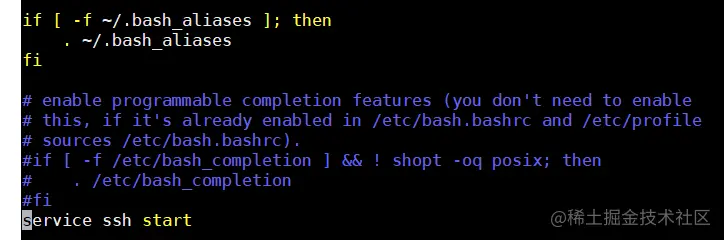
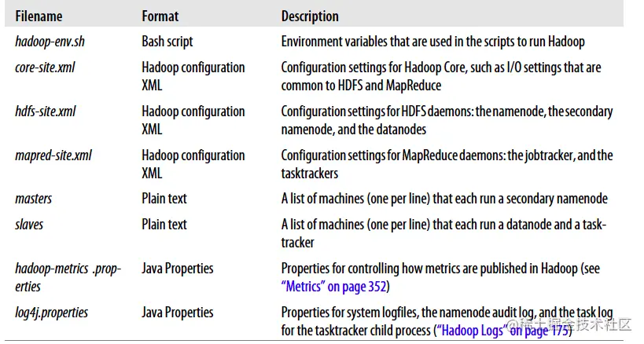
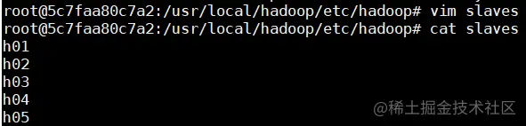
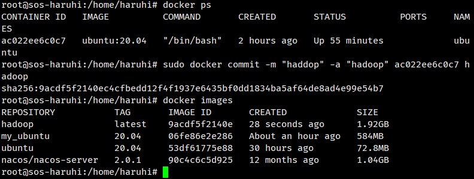
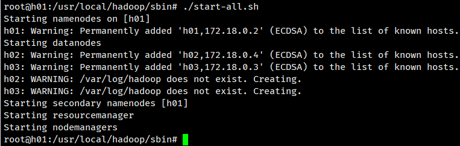
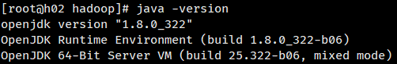
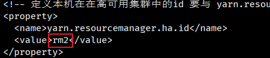
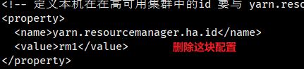

# 一、Hadoop Docker 集群快速部署

### 安装思路为

```
安装docker -> 运行docker导入ubuntu镜像 -> 运行ubuntu系统 -> 在系统中配置好单个节点 -> 
将配置好的单个节点系统导出为镜像 -> 根据镜像启动多个docker容器 -> 多个docker容器就是集群了。
总结：就是说你要先刻好一个模板，然后用这个模板去生成多个一样的东西，然后由这些来组成集群
```

### 安装docker

```
wget -qO- https://get.docker.com/ | sh
复制代码
```

> 补充：wget是Linux中的一个下载文件的工具，用在命令行下，是一个非常强大的必不可少工具。 wget支持自动下载，就是说你可以登录系统启动一个wget任务，然后退出系统，这个任务将会一直执行， 如果这个任务被系统打断，再次启动的时候会从停止的地方继续下载，这对限定了链接时间的服务器非常有用。 同时支持多种协议HTTP，HTTPS，支持代理。 更多wget知识[参考链接](https://link.juejin.cn?target=https%3A%2F%2Fwww.cnblogs.com%2Fpeida%2Farchive%2F2013%2F03%2F18%2F2965369.html)

#### 启动docker

安装完成以后如下指令启动docker：

```
sudo service docker start
```

#### 使用docker构建虚拟桥接网络

由于docker网络自带了DNS解析功能，可以使用如下命令来构建一个名为hadoop的虚拟化桥接网络，该网络提供了了内部的DNS借下服务，会给集群内的机器分配IP，供之后的集群使用。

```
sudo docker network create --driver=bridge hadoop
```

如果需要查看docker中的网络，可以使用如下命令来查看

```
sudo docker network ls
root@iZ2ze8dsxce9ufrpvxlluxZ:~# docker network ls
NETWORK ID          NAME                DRIVER              SCOPE
22836c77585e        bridge              bridge              local
714594f681c1        hadoop              bridge              local
08965f3ddcd7        host                host                local
2d1234b6fccd        none                null                local
```

#### 查找ubuntu容器

```
sudo docker search ubuntu
```

#### 下载ubuntu16.04版本镜像

```
sudo docker pull ubuntu:20.04
```

#### 启动容器

```
## 启动镜像
sudo docker run --name ubuntu -it -d ubuntu:20.04 /bin/bash

## 退出容器
exit

## 启动 ubuntu 容器
sudo docker start ubuntu

## 进入容器
sudo docker exec -it ubuntu /bin/bash
```

##### 安装JDK1.8

```
apt install openjdk-8-jdk

java -version
```

##### 安装Scala

```
apt install scala
```

### 安装Hadoop

```
apt install vim
apt install net-tools
```

#### 安装vim和net-tools网络工具包

```
apt install vim
apt install net-tools
```

#### 安装SSH

```
apt-get install openssh-server
apt-get install openssh-client
```

#### 配置SSH免密通信

进入用户根目录：

```
cd ~
```

生成公钥，输入一下指令后，一直回车，不用输入其他内容，这样生成的密钥文件会保存在默认位置 一定要复制这个指令，因为指令里面的P是大写，要是小写会报错。

```
ssh-keygen -t rsa -P ""
```

将公钥追加到authorized_keys中

```
cat .ssh/id_rsa.pub >> .ssh/authorized_keys
```

启动SSH服务

```
service ssh start
```

免密登录自己

```
ssh 127.0.0.1
```

修改.bashrc文件，启动shell的时候，自动启动SSH服务。打开文件`vim ~/.bashrc`追加如下代码在末尾。

```
service ssh start
```

 

**SSH的配置非常重要，在后面的集群启动中，遇到了错误`Host key verification failed.`，具体的解决方案为，使用ssh 172.19.0.x逐个连接容器，然后在启动集群，在遇到是否继续连接是，每个都输入yes，随后就启动成功。**

#### 安装Hadoop

拉取Hadoop安装文件，你可以更换其他的镜像源，或其他的版本。

```
wget http://mirrors.hust.edu.cn/apache/hadoop/common/hadoop-3.2.0/hadoop-3.2.0.tar.gz
```

解压到/usr/local

```
tar -zxvf hadoop-3.2.0.tar.gz -C /usr/local/
补充：tar指令参数-C为切换到指定的目录，格式为：-C<目的目录>或--directory=<目的目录> 
```

在/etc/profile中修改环境变量`vim /etc/profile`，追加如下内容：

```
#java
export JAVA_HOME=/usr/lib/jvm/java-8-openjdk-amd64
export JRE_HOME=${JAVA_HOME}/jre    
export CLASSPATH=.:${JAVA_HOME}/lib:${JRE_HOME}/lib    
export PATH=${JAVA_HOME}/bin:$PATH
#hadoop
export HADOOP_HOME=/usr/local/hadoop
export PATH=$PATH:$HADOOP_HOME/bin:$HADOOP_HOME/sbin
export HADOOP_COMMON_HOME=$HADOOP_HOME 
export HADOOP_HDFS_HOME=$HADOOP_HOME 
export HADOOP_MAPRED_HOME=$HADOOP_HOME
export HADOOP_YARN_HOME=$HADOOP_HOME 
export HADOOP_INSTALL=$HADOOP_HOME 
export HADOOP_COMMON_LIB_NATIVE_DIR=$HADOOP_HOME/lib/native 
export HADOOP_CONF_DIR=$HADOOP_HOME 
export HADOOP_LIBEXEC_DIR=$HADOOP_HOME/libexec 
export JAVA_LIBRARY_PATH=$HADOOP_HOME/lib/native:$JAVA_LIBRARY_PATH
export HADOOP_CONF_DIR=$HADOOP_PREFIX/etc/hadoop
export HDFS_DATANODE_USER=root
export HDFS_DATANODE_SECURE_USER=root
export HDFS_SECONDARYNAMENODE_USER=root
export HDFS_NAMENODE_USER=root
export YARN_RESOURCEMANAGER_USER=root
export YARN_NODEMANAGER_USER=root
export HADOOP_CONF_DIR=$HADOOP_HOME/etc/hadoop
```

要使环境变量生效，还需要source一下：

```
source /etc/profile
```

配置Hadoop

进入Hadoop配置目录

```
cd /usr/local/hadoop/etc/hadoop
```

正常启动需要配置五个文件，slaves、core-site.xml、hdfs-site.xml、mapred-site.xml、yarn-site.xml。

 


- core-site.xml：核心配置文件，定义了集群是分布式，还是本机运行
- hdfs-site.xml：分布式文件系统的核心配置，决定了数据存放路径，数据的副本，数据的block块大小等等
- mapred-site.xml：定义了mapreduce运行的一些参数
- yarn-site.xml：定义yarn集群
- slaves：定义了从节点是哪些机器datanode，nodemanager运行在哪些机器上
- hadoop-env.sh：配置jdk的home路径
- 可参考《Hadoop权威指南》，第十章10.3hadoop配置。

##### 配置mapred-site.xml

默认没有mapred-site.xml文件，但是有个mapred-site.xml.template配置模板文件。复制模板生成mapred-site.xml。

```
cp etc/hadoop/mapred-site.xml.template etc/hadoop/mapred-site.xml
vi mapred-site.xml
```

修改mapred-site.xml为：

```
<configuration>
    <property>
        <name>mapreduce.framework.name</name>
        <value>yarn</value>
    </property>
    <property>
        <name>mapreduce.application.classpath</name>
        <value>
            /usr/local/hadoop/etc/hadoop,
            /usr/local/hadoop/share/hadoop/common/*,
            /usr/local/hadoop/share/hadoop/common/lib/*,
            /usr/local/hadoop/share/hadoop/hdfs/*,
            /usr/local/hadoop/share/hadoop/hdfs/lib/*,
            /usr/local/hadoop/share/hadoop/mapreduce/*,
            /usr/local/hadoop/share/hadoop/mapreduce/lib/*,
            /usr/local/hadoop/share/hadoop/yarn/*,
            /usr/local/hadoop/share/hadoop/yarn/lib/*
        </value>
    </property>
</configuration>
```

- mapreduce.framework.name：指定mapreduce运行框架
- mapred.job.tracker：运行jobtracker的主机名和端口号
- mapred.local.dir：存储作业中间数据的目录，作业终止时，目录被清空，以逗号分隔多个目
- mapred.system.dir：作业运行期间存储共享文件的位置，相对于fs.default.name，默认是${hadoop.tmp.dir}/mapred/system
- mapred.tasktracker.map.tasks.maximum：同一时间允许运行的最大map任务数，默认为2
- mapred.tasktracker.reduce.tasks.maximum：同一时间允许运行的最大map任务数，默认为2

##### 配置 workers

文件slaves，将作为DataNode的主机名写入该文件，每行一个，默认为localhost，所以在伪分布式配置时，节点即作为NameNode也作为DataNode。分布式配置可以保留localhost，也可以删掉，让Master节点仅作为NameNode使用。此处让Master节点仅作为NameNode使用，因此将文件中原来的localhost删除。

- masters记录的是需要启动secondary namenode的节点, 不是namenode，它也和mapreduce没任何关系。
- slaves记录的是执行start-all.sh（或相关命令）时，需要远程启动tasktracker与datanode的节点。
- 这2个文件不需要分发至各个工作节点。
- 哪个机器执行启动脚本，那它就是jobtracke与namenode，再根据masters确定secondary namenode, 根据slaves文件确定tasktracker与datanode，并远程启动这些守护进程。

此处只是给主机取一个名字而已，后面启动容器的时候将对应的容器命名为h01,h02,,,h05就是。 由于疫情，加上学校的服务器断电了用不了，我在10块一个月的学生服务器上测试的，事实证明，五个节点直接撑爆了服务器，后期修改为了三个，勉强能跑，所以建议服务器性能不佳的兄弟写h01,h02,h03就行了。。。

 

```
vim /usr/local/hadoop/etc/hadoop/workers

h01
h02
h03

cat /usr/local/hadoop/etc/hadoop/workers
```

##### 配置core-site.xml

```
vi core-site.xml
```

configuration内修改为：

```
<configuration>
    <property>
        <name>fs.default.name</name>
        <value>hdfs://h01:9000</value>
    </property>
    <property>
        <name>hadoop.tmp.dir</name>
        <value>/home/hadoop3/hadoop/tmp</value>
    </property>
</configuration>
```

- fs.defaultFS.name：默认文件系统，配置的地址就是java代码访问的时候的路径，需要配置在java代码中，代码中要用IP:9000不能用localhost
- hadoop.tmp.dir：配置临时文件存放位置。默认是/tmp/hadoop-$user，此位置有可能在重启时被清空，因此必须另外配置。这个属性会影响namenode/secondary namenode中的元数据与datanode中的数据文件存放位置。

##### 配置hdfs-site.xml

```
vi hdfs-site.xml
```

修改为：

```
<configuration>
    <property>
        <name>dfs.replication</name>
        <value>2</value>
    </property>
    <property>
        <name>dfs.namenode.name.dir</name>
        <value>/home/hadoop3/hadoop/hdfs/name</value>
    </property>
    <property>
        <name>dfs.namenode.data.dir</name>
        <value>/home/hadoop3/hadoop/hdfs/data</value>
    </property>
</configuration>
```

- dfs.data.dir：保存datanode数据文件的位置，可以指定多个目录，这多个目录位于不同的磁盘可以提高IO使用率。默认是${hadoop.tmp.dir}/dfs/data
- dfs.replication：hdfs的冗余复本数量，默认为3
- dfs.namenode.name.dir：保存namenode元数据的位置，也就是namenode元数据存放的地方，记录了hdfs系统中文件的元数据。可以指定多个目录，元数据文件会同时写入这几个目录，从而支持冗余备份。最好有一个是NFS网络硬盘。

##### 配置yarn-site.xml

```
vi yarn-site.xml
```

修改为：

```
<configuration>
    <property>
        <name>yarn.resourcemanager.hostname</name>
        <value>h01</value>
    </property>
    <property>
        <name>yarn.nodemanager.aux-services</name>
        <value>mapreduce_shuffle</value>
    </property>
</configuration>	
```

##### 配置hadoop-env.sh

```
vi hadoop-env.sh
```

在文件末尾添加：

```
export JAVA_HOME=/usr/lib/jvm/java-8-openjdk-amd64
export HDFS_NAMENODE_USER=root
export HDFS_DATANODE_USER=root
export HDFS_SECONDARYNAMENODE_USER=root
export YARN_RESOURCEMANAGER_USER=root
export YARN_NODEMANAGER_USER=root
export HADOOP_HEAPSIZE=500M
export HADOOP_LOG_DIR=/var/log/hadoop
```

- JAVA_HOME必须设置，其余均为可选项
- HADOOP_HEAPSIZE：分配给各个守护进程的内存大小，默认为1000M。另外，可以使用HADOOP_NAMENODE_OPTS等单独设置某一守护进行的内存大小。大型集群一般设置2000M或以上，开发环境中设置500M足够了。
- HADOOP_LOG_DIR：日志文件的存放目录，可以设置为/var/log/hadoop

**至此，hadoop配置基本可以了，接下来就将这个容器导出为镜像，然后依次启动**

### 在docker中启动集群

#### 首先将容器导出为镜像

```
docker ps
#　获取 container id　　ac022ee6c0c7
sudo docker commit -m "haddop" -a "hadoop" ac022ee6c0c7 hadoop
```

 

随后，分别启动五个节点。

#### 首先是启动h01作为主节点

由于是主节点，所以打开端口，提供web页面访问。

```
sudo docker run -it -d --network hadoop -h "h01" --name "h01" -p 9000:9000 -p 9870:9870 -p 8088:8088 -p 9866:9866 -p 50010:50010 hadoop /bin/bash
```

> --network hadoop 参数是将当前容器加入到名为 `hadoop` 的虚拟桥接网络中，此网站提供自动的 DNS 解析功能

其余的两条命令就是几乎一样的了

```
docker run -it -d --network hadoop -h "h02" --name "h02" hadoop /bin/bash
docker run -it -d --network hadoop -h "h03" --name "h03" hadoop /bin/bash
```

接下来，在 `h01` 主机中，启动 Haddop 集群

先进行格式化操作

> 不格式化操作，hdfs会起不来

```
# 进入 h01
docker exec -it h01 /bin/bash
# 初始化 hadoop
./usr/local/hadoop/bin/hadoop namenode -format
```

进入 hadoop 的 sbin 目录

```text
cd /usr/local/hadoop/sbin/
```

启动

```
./usr/local/hadoop/sbin/start-all.sh
```

 

访问本机的 8088 与 9870 端口就可以看到监控信息了

使用命令 `./usr/local/hadoop/bin/hadoop dfsadmin -report` 可查看分布式文件系统的状态


### ubuntu修改hosts后马上生效

#### Method 1

```
sudo apt-get install nscd


sudo /etc/init.d/nscd restart
```

#### Method 2

```
sudo /etc/init.d/networking restart
```

#### Method 3

```
sudo /etc/init.d/dns-clean start
```

# 二、Hadoop HA 高可用集群快速部署

## 2.1 集群的规划

#### Zookeeper集群：

```
192.168.5.37 （h01）
192.168.5.34 （h03）
192.168.5.31 （h04）
```

#### Hadoop集群：

| 主机                 |                                                              |
| -------------------- | ------------------------------------------------------------ |
| 192.168.5.37 （h01） | NameNode1主节点		Journalnode		DataNode1          |
| 192.168.5.32 （h02） | NameNode2备用主节点    Journalnode	DataNode2              |
| 192.168.5.34 （h03） | DataNode3      NodeManager1		ResourceManager1主节点    |
| 192.168.5.31 （h04） | DataNode4      NodeManager2		ResourceManager2备用主节点 |

## 2.2 基础设施准备

- [x] 设置 ip 与 主机名

  ```
  # 修改网络配置文件
  vi /etc/sysconfig/network-scripts/ifcfg-ens192
  
  # 每个主机分别配置	HOSTNAME=h01/h02/h03/h04
  NETWORKING=yes
  HOSTNAME=h01
  
  # 修改 host
  vi /etc/hosts
  
  # 添加下列 ost 信息
  127.0.0.1   localhost localhost.localdomain localhost4 localhost4.localdomain4
  ::1         localhost localhost.localdomain localhost6 localhost6.localdomain6
  
  192.168.5.37 h01
  192.168.5.32 h02
  192.168.5.34 h03
  192.168.5.31 h04
  
  # 重启网络 （hadoop@h01  hostname 重新连接，观察变化）
  service network restart
  ```

   

- [x] 关闭防火墙 & selinux

  ```
  # 临时关闭防火墙
  systemctl stop firewalld
  #　永久关闭防火墙
  systemctl disable firewalld
  
  # 临时关闭 selinux
  setenforce 0
  # 永久关闭 selinux
  vi /etc/selinux/config
  SELINUX=enforcing         修改为"SELINUX=disabled"
  ```

- [x] 时间同步

  ```
  # 配置时区
  cp /usr/share/zoneinfo/Asia/Shanghai /etc/localtime
  y
  
  # 启动 ntp 时间同步工具
  yum install ntp
  systemctl enable ntpd.service
  systemctl start ntpd.service
  ```

- [x] 用户配置

  ```
  groupadd hadoop
  useradd -g hadoop hadoop
  ```

  ```
  # 修改密码
  passwd hadoop
  seatone@123
  ```

  ```
  # 设置用户 sudo 权限 （root 用户下输入 visudo， 文件末尾添加 hadoop ALL=(ALL) NOPASSWD:ALL 即可
  su root
  visudo
  hadoop        ALL=(ALL)       NOPASSWD: ALL
  ```

- [x] 设置集群 hadoop 用户 SSH 免密钥

  ```
  su hadoop
  ssh-keygen -t rsa
  ```

  ```
  cd ~/.ssh
  
  # 将四台机器的公钥文件合并到authorized_keys
  
  # 本机
  cat id_rsa.pub >> authorized_keys
  
  # 其他主机 合并 pub_key
  ssh hadoop@h02 cat ~/.ssh/id_rsa.pub >> authorized_keys
  ssh hadoop@h03 cat ~/.ssh/id_rsa.pub >> authorized_keys
  ssh hadoop@h04 cat ~/.ssh/id_rsa.pub >> authorized_keys
  ```

  ```
  # authorized_keys文件复制到其他节点
  scp /home/hadoop/.ssh/authorized_keys hadoop@h02:/home/hadoop/.ssh/
  scp /home/hadoop/.ssh/authorized_keys hadoop@h03:/home/hadoop/.ssh/
  scp /home/hadoop/.ssh/authorized_keys hadoop@h04:/home/hadoop/.ssh/
  ```

  ```
  # 为每台机器下  ~/.ssh  文件夹授予 700（读、写、执行 4+2+1） 权限
  cd /home/hadoop
  chmod 700 .ssh
  # .ssh 目录下所有文件 授予 600 权限
  chmod 600 .ssh/*
  ```

- [x] 安装 JDK

  ```
  su root
  yum install -y java-1.8.0-openjdk-devel.x86_64 java-1.8.0-openjdk.x86_64
  ```

  编辑/etc/profile, 在末尾添加

  ```
  vi /etc/profile
  
  # 追加
  export JAVA_HOME=/usr/lib/jvm/jre-1.8.0
  ```

  ```
  source /etc/profile
  java -version
  ```

   

- [x] **Ansible 安装** （只在  **master** 节点安装）

  ```
  rpm -Uvh http://mirrors.ustc.edu.cn/epel/epel-release-latest-7.noarch.rpm
  
  yum install epel-release -y
  
  yum install ansible
  ```

  **ansible 配置**  （只在  **master** 节点配置）

  ```
  /etc/ansible/hosts
  ```

  ```
  [ssh]
  192.168.5.37 ansible_ssh_user=hadoop ansible_ssh_pass=seatone@123
  192.168.5.32 ansible_ssh_user=hadoop ansible_ssh_pass=seatone@123
  192.168.5.34 ansible_ssh_user=hadoop ansible_ssh_pass=seatone@123
  192.168.5.31 ansible_ssh_user=hadoop ansible_ssh_pass=seatone@123
  
  # 所有节点
  [web]
  192.168.5.37
  192.168.5.32
  192.168.5.34
  192.168.5.31
  
  # 从节点
  [slaver]
  192.168.5.32
  192.168.5.34
  192.168.5.31
  
  # zookeeper 节点
  [zk]
  192.168.5.37
  192.168.5.34
  192.168.5.31
  ```

  

- [ ] ###### 内核调优

  #### 调大打开文件数

  修改/etc/security/limits.conf

  ```shell
  *               soft    nofile          65555
  *               hard    nofile          65555
  *               hard    core            65555
  *               soft    core            65555
  *               hard    noproc          65555
  *               soft    noproc          65555
  ```

  修改netfilter 配置

  ~~~shell
  #net.netfilter.nf_conntrack_buckets 的值
  # 临时生效
  echo 262144 > /sys/module/nf_conntrack/parameters/hashsize
  # 重启永久生效，新建文件：/etc/modprobe.d/iptables.conf，设置如下
  options nf_conntrack hashsize = 32768 
  
  # 修改net.netfilter.nf_conntrack_max 最大追踪连接数修改 调优
  # 临时生效
  sudo sysctl -w net.netfilter.nf_conntrack_max=1048576
  suod sysctl -w net.nf_conntrack_max=1048576
  
  # 永久生效
  # 添加修改内核配置文件（/etc/sysctl.conf） 
  net.netfilter.nf_conntrack_max=1048576
  net.nf_conntrack_max=1048576
  # 当数据包超长时，不丢弃数据包。K8S重要
  net.netfilter.nf_conntrack_tcp_be_liberal=1
  
  # 如果要马上应用配置文件里的设置：
  sudo sysctl -p /etc/sysctl.conf
  
  # 临时生效
  
  # 主动方的最后1个状态。默认120秒
  sudo sysctl -w net.netfilter.nf_conntrack_tcp_timeout_fin_wait=30
  sudo sysctl -w net.netfilter.nf_conntrack_tcp_timeout_time_wait=30
  
  # CLOSE_WAIT是被动方收到FIN发ACK，然后会转到LAST_ACK发FIN，除非程序写得有问题，正常来说这状态持续时间很短。#默认 60 秒
  sudo sysctl -w net.netfilter.nf_conntrack_tcp_timeout_close_wait=15
  
  # 理论上不用这么长，不小于 net.ipv4.tcp_keepalive_time 就行了。默认 432000 秒（5天）
  sudo sysctl -w net.netfilter.nf_conntrack_tcp_timeout_established=300
  
  -----------------------------------------------------
  
  # 永久生效
  # 修改内核配置文件（/etc/sysctl.conf） 
  net.netfilter.nf_conntrack_tcp_timeout_fin_wait=30
  net.netfilter.nf_conntrack_tcp_timeout_time_wait=30
  net.netfilter.nf_conntrack_tcp_timeout_close_wait=15
  net.netfilter.nf_conntrack_tcp_timeout_established=300
  
  # 如果要马上应用配置文件里的设置：
  sudo sysctl -p /etc/sysctl.conf
  
  
  ## 安装 lrzsz
  ``` shell
  yum  install -y lrzsz
  ~~~

## 2.3 Zookeeper 配置

1. zookerper 安装包下载

     上传 zookeeper 包到 ~/ 目录

2. ansible 分发 ZK 安装包

   ```
   ansible zk -m copy -a 'src=~/apache-zookeeper-3.7.0-bin.tar.gz dest=~/'
   ansible zk -a "tar -zxvf ~/apache-zookeeper-3.7.0-bin.tar.gz -C ~/"
   ansible zk -a "mv ~/apache-zookeeper-3.7.0-bin ~/zookeeper-3.7.0"
   ```

3. 添加 zookeeper datadir，后续配置文件进行配置

   ```
   ansible zk -a 'mkdir -p ~/data/zookeeper'
   ```

4. 修改 conf/zoo.cfg 并分发配置文件

   ```
   cp /home/hadoop/zookeeper-3.7.0/conf/zoo_sample.cfg /home/hadoop/zookeeper-3.7.0/conf/zoo.cfg
   vi /home/hadoop/zookeeper-3.7.0/conf/zoo.cfg
   ```

   修改 zoo.cfg  配置

   ```
   # 修改
   dataDir=/home/hadoop/data/zookeeper/zkdata
   dataLogDir=/home/hadoop/data/zookeeper/zkdatalog
   
   # 追加
   server.1=h01:2888:3888
   server.3=h03:2888:3888
   server.4=h04:2888:3888
   ```

   ```
   ansible zk -a "mkdir -p /home/hadoop/data/zookeeper/zkdata"
   ansible zk -a "mkdir -p /home/hadoop/data/zookeeper/zkdatalog"
   ```

   ```
   ansible zk -m copy -a "src=/home/hadoop/zookeeper-3.7.0/conf/zoo.cfg dest=/home/hadoop/zookeeper-3.7.0/conf/zoo.cfg"
   ```

5. myid 文件配置

   进入各个节点 /home/hadoop/data/zookeeper/zkdata 目录，创建 myid 文件，内容分别 1， 2， 3

   ```
   vi /home/hadoop/data/zookeeper/zkdata/myid
   1
   ```

   ```
   vi /home/hadoop/data/zookeeper/zkdata/myid
   3
   ```

   ```
   vi /home/hadoop/data/zookeeper/zkdata/myid
   4
   ```

6. 启动服务

   ```
   ansible zk -a "/home/hadoop/zookeeper-3.7.0/bin/zkServer.sh start"
   ansible zk -a "/home/hadoop/zookeeper-3.7.0/bin/zkServer.sh status"
   ansible zk -a "/home/hadoop/zookeeper-3.7.0/bin/zkServer.sh stop"
   ```

## 2.4 安装 Hadoop

1. hadoop 安装包下载

   上传到服务器 ~/

2.  ansible 分发安装包

   ```
   ansible slaver -m copy -a 'src=~/hadoop-3.2.2.tar.gz dest=~/'
   ansible web -a 'tar -zxvf ~/hadoop-3.2.2.tar.gz -C ~/'
   ```

3. 创建 hadoop 临时目录

   ```
   ansible web -a 'mkdir -p ~/data/hadoop'
   ansible web -a 'mkdir -p ~/data/hadoop/journalnode/data'
   ansible web -a 'mkdir -p ~/data/hadoop/hdfs/namenode'
   ansible web -a 'mkdir -p ~/data/hadoop/hdfs/datanode'
   
   
   # 暂时不需要了
   ansible web -a 'mkdir -p ~/data/hadoop/log'
   ansible web -a 'mkdir -p ~/hadoop-3.2.2/pid'
   ```

4.  每个机器 配置 环境变量

   ```
   vi /etc/profile
   ```

   ```
   # java
   export JAVA_HOME=/usr/lib/jvm/jre-1.8.0
   export JRE_HOME=${JAVA_HOME}/jre    
   export CLASSPATH=.:${JAVA_HOME}/lib:${JRE_HOME}/lib    
   export PATH=${JAVA_HOME}/bin:$PATH
   
   # hadoop
   export HADOOP_HOME=/home/hadoop/hadoop-3.2.2
   export PATH=$PATH:$HADOOP_HOME/bin:$HADOOP_HOME/sbin
   export HADOOP_COMMON_HOME=$HADOOP_HOME 
   export HADOOP_HDFS_HOME=$HADOOP_HOME 
   export HADOOP_MAPRED_HOME=$HADOOP_HOME
   export HADOOP_YARN_HOME=$HADOOP_HOME 
   export HADOOP_INSTALL=$HADOOP_HOME 
   export HADOOP_COMMON_LIB_NATIVE_DIR=$HADOOP_HOME/lib/native 
   export HADOOP_CONF_DIR=$HADOOP_HOME 
   export HADOOP_LIBEXEC_DIR=$HADOOP_HOME/libexec 
   export JAVA_LIBRARY_PATH=$HADOOP_HOME/lib/native:$JAVA_LIBRARY_PATH
   export HADOOP_CONF_DIR=$HADOOP_PREFIX/etc/hadoop
   export HDFS_DATANODE_USER=hadoop
   export HDFS_DATANODE_SECURE_USER=hadoop
   export HDFS_SECONDARYNAMENODE_USER=hadoop
   export HDFS_NAMENODE_USER=hadoop
   export YARN_RESOURCEMANAGER_USER=hadoop
   export YARN_NODEMANAGER_USER=hadoop
   export HADOOP_CONF_DIR=$HADOOP_HOME/etc/hadoop
   ```

   ```
   source /etc/profile
   ```

   

5.  处理 hadoop 配置文件

   ```
   下载配置文件	（/home/hadoop/hadoop-3.2.2/etc/hadoop/）
   core-site.xml 
   hdfs-site.xml 
   mapred-site.xml
   yarn-site.xml
   ```

   编辑配置文件

   > core-site.xml
   >
   > ```
   > <configuration>
   >     <!-- 指定hdfs的nameservice为ns1 -->
   >     <!-- <property>
   >         <name>fs.defaultFS</name>
   >         <value>hdfs://ns1/</value>
   >     </property> -->
   >     <property>
   >         <name>fs.default.name</name>
   >         <value>hdfs://h01:9000</value>
   >     </property>
   > 
   >     <!-- 指定hadoop临时目录 -->
   >     <property>
   >         <name>hadoop.tmp.dir</name>
   >         <value>/home/hadoop/data</value>
   >     </property>
   > 
   >     <!-- 指定zookeeper地址 -->
   >     <property>
   >         <name>ha.zookeeper.quorum</name>
   >         <value>h01:2181,h03:2181,h04:2181</value>
   >     </property>
   >     <!-- <property>
   >         <name>ha.zookeeper.session-timeout.ms</name>
   >         <value>3000</value>
   >     </property> -->
   > </configuration>
   > ```

   > hdfs-site.xml
   >
   > ```
   > <configuration>
   >   <!-- hdfs HA configuration-->
   >   <!-- all default configuration can be found at https://hadoop.apache.org/docs/stable|<can be a version liek r3.2.1></can>/hadoop-project-dist/hadoop-hdfs//hdfs-default.xml -->
   >   
   >   <property>
   >     <name>dfs.ha.automatic-failover.enabled</name>
   >     <value>true</value>
   >   </property>
   >   <!-- dfs.nameservices 这里需要与core-site.xml 中fs.defaultFS 的名称一致-->
   >   <property>
   >     <name>dfs.nameservices</name>
   >     <value>mycluster</value>
   >   </property>
   >   <!-- 定义集群中 namenode 列表，这里定义了三个namenode，分别是nn1,nn2,nn3-->
   >   <property>
   >     <name>dfs.ha.namenodes.mycluster</name>
   >     <value>nn1,nn2,nn3,nn4</value>
   >   </property>
   >   <!-- namenode nn1的具体定义，这里要和 dfs.ha.namenodes.mycluster 定义的列表对应 -->
   >   <property>
   >     <name>dfs.namenode.rpc-address.mycluster.nn1</name>
   >     <value>h01:8020</value>
   >   </property>
   >   <property>
   >     <name>dfs.namenode.rpc-address.mycluster.nn2</name>
   >     <value>h02:8020</value>
   >   </property>
   >   <property>
   >     <name>dfs.namenode.rpc-address.mycluster.nn3</name>
   >     <value>h03:8020</value>
   >   </property>
   >   <property>
   >     <name>dfs.namenode.rpc-address.mycluster.nn4</name>
   >     <value>h04:8020</value>
   >   </property>
   >   <!-- namenode nn1的具体定义，这里要和 dfs.ha.namenodes.mycluster 定义的列表对应 -->
   >   <property>
   >     <name>dfs.namenode.http-address.mycluster.nn1</name>
   >     <value>h01:9870</value>
   >   </property>
   >   <property>
   >     <name>dfs.namenode.http-address.mycluster.nn2</name>
   >     <value>h02:9870</value>
   >   </property>
   >   <property>
   >     <name>dfs.namenode.http-address.mycluster.nn3</name>
   >     <value>h03:9870</value>
   >   </property>
   >   <property>
   >     <name>dfs.namenode.http-address.mycluster.nn4</name>
   >     <value>h04:9870</value>
   >   </property>
   > <!-- 指定NameNode的元数据在JournalNode上的存放位置 -->
   >   <property>
   >     <name>dfs.namenode.shared.edits.dir</name>
   >     <value>qjournal://h01:8485;h02:8485;h03:8485;h04:8485/mycluster</value>
   >   </property>
   >   <!-- 指定JournalNode在本地磁盘存放数据的位置 -->
   >   <property>
   >     <name>dfs.journalnode.edits.dir</name>
   >     <value>/home/hadoop/data/hadoop/journalnode/data</value>
   >   </property>
   >   <!-- 配置失败自动切换实现方式 -->
   >   <property>
   >     <name>dfs.client.failover.proxy.provider.mycluster</name>
   >     <value>org.apache.hadoop.hdfs.server.namenode.ha.ConfiguredFailoverProxyProvider</value>
   >   </property>
   >   <!-- 配置隔离机制方法，多个机制用换行分割，即每个机制暂用一行-->
   >   <property>
   >     <name>dfs.ha.fencing.methods</name>
   >     <value>sshfence</value>
   >   </property>
   >   <!-- 使用sshfence隔离机制时需要ssh免登陆 -->
   >   <property>
   >     <name>dfs.ha.fencing.ssh.private-key-files</name>
   >     <value>/home/hadoop/.ssh/id_rsa</value>
   >   </property>
   >   <!-- 配置sshfence隔离机制超时时间 -->
   >   <property>
   >     <name>dfs.ha.fencing.ssh.connect-timeout</name>
   >     <value>30000</value>
   >   </property>
   >   <property>
   >     <name>dfs.journalnode.http-address</name>
   >     <value>0.0.0.0:8480</value>
   >   </property>
   >   <property>
   >     <name>dfs.journalnode.rpc-address</name>
   >     <value>0.0.0.0:8485</value>
   >   </property>
   >   <!-- hdfs HA configuration end-->
   > 
   >   <property>
   >     <name>dfs.replication</name>
   >     <value>2</value>
   >   </property>
   >   <property>
   >     <name>dfs.namenode.name.dir</name>
   >     <value>/home/hadoop/data/hadoop/hdfs/namenode</value>
   >   </property>
   >   <property>
   >     <name>dfs.datanode.data.dir</name>
   >     <value>/home/hadoop/data/hadoop/hdfs/datanode</value>
   >   </property>
   >   <!--开启webhdfs接口访问-->
   >   <property>
   >     <name>dfs.webhdfs.enabled</name>
   >     <value>true</value>
   >   </property>
   >   <!-- 关闭权限验证，hive可以直连 -->
   >   <property>
   >     <name>dfs.permissions.enabled</name>
   >     <value>false</value>
   >   </property>
   > </configuration>
   > ```

   > yarn-site.xml
   >
   > ```
   > <configuration>
   > 
   >   <!-- yarn ha configuration-->
   >   <property>
   >     <name>yarn.resourcemanager.ha.enabled</name>
   >     <value>true</value>
   >   </property>
   >   <!-- 定义集群名称 -->
   >   <property>
   >     <name>yarn.resourcemanager.cluster-id</name>
   >     <value>cluster1</value>
   >   </property>
   >   <!-- 定义本机在在高可用集群中的id 要与 yarn.resourcemanager.ha.rm-ids 定义的值对应，如果不作为resource manager 则删除这项配置。-->
   >   <property>
   >     <name>yarn.resourcemanager.ha.id</name>
   >     <value>rm1</value>
   >   </property>
   >   <!-- 定义高可用集群中的 id 列表 -->
   >   <property>
   >     <name>yarn.resourcemanager.ha.rm-ids</name>
   >     <value>rm1,rm2</value>
   >   </property>
   >   <!-- 定义高可用RM集群具体是哪些机器 -->
   >   <property>
   >     <name>yarn.resourcemanager.hostname.rm1</name>
   >     <value>h03</value>
   >   </property>
   >   <property>
   >     <name>yarn.resourcemanager.hostname.rm2</name>
   >     <value>h04</value>
   >   </property>
   >   <property>
   >     <name>yarn.resourcemanager.webapp.address.rm1</name>
   >     <value>h03:8088</value>
   >   </property>
   >   <property>
   >     <name>yarn.resourcemanager.webapp.address.rm2</name>
   >     <value>h04:8088</value>
   >   </property>
   >   <property>
   >     <name>hadoop.zk.address</name>
   >     <value>h01:2181,h03:2181,h04:2181</value>
   >   </property>
   > 
   >   <!-- Site specific YARN configuration properties -->
   >   <property>
   >     <name>yarn.nodemanager.aux-services</name>
   >     <value>mapreduce_shuffle</value>
   >   </property>
   > </configuration>
   > ```

   > mapred-site.xml
   >
   > ```
   > <configuration>
   >   <property>
   >     <name>mapreduce.framework.name</name>
   >     <value>yarn</value>
   >   </property>
   >   <property>
   >     <name>mapreduce.application.classpath</name>
   >     <value>  
   >         /home/hadoop/hadoop-3.2.2/share/hadoop/common/*,
   >         /home/hadoop/hadoop-3.2.2/share/hadoop/common/lib/*,
   >         /home/hadoop/hadoop-3.2.2/share/hadoop/hdfs/*,
   >         /home/hadoop/hadoop-3.2.2/share/hadoop/hdfs/lib/*,
   >         /home/hadoop/hadoop-3.2.2/share/hadoop/mapreduce/*,
   >         /home/hadoop/hadoop-3.2.2/share/hadoop/mapreduce/lib/*,
   >         /home/hadoop/hadoop-3.2.2/share/hadoop/yarn/*,
   >         /home/hadoop/hadoop-3.2.2/share/hadoop/yarn/lib/*
   >     </value>
   >   </property>
   > 
   > </configuration>
   > ```

   > hadoop-env.sh
   >
   > ```
   > export JAVA_HOME=/usr/lib/jvm/jre-1.8.0
   > export HADOOP_HOME=/home/hadoop/hadoop-3.2.2
   > export HADOOP_CONF_DIR=${HADOOP_HOME}/etc/hadoop
   > 
   > for f in $HADOOP_HOME/contrib/capacity-scheduler/*.jar; do
   >   if [ "$HADOOP_CLASSPATH" ]; then
   >     export HADOOP_CLASSPATH=$HADOOP_CLASSPATH:$f
   >   else
   >     export HADOOP_CLASSPATH=$f
   >   fi
   > done
   > 
   > export HADOOP_OS_TYPE=${HADOOP_OS_TYPE:-$(uname -s)}
   > export HADOOP_OPTS="$HADOOP_OPTS -Djava.net.preferIPv4Stack=true"
   > 
   > export HDFS_NAMENODE_OPTS="-Dhadoop.security.logger=${HADOOP_SECURITY_LOGGER:-INFO,RFAS} -Dhdfs.audit.logger=${HDFS_AUDIT_LOGGER:-INFO,NullAppender} $HDFS_NAMENODE_OPTS"
   > export HDFS_DATANODE_OPTS="-Dhadoop.security.logger=ERROR,RFAS $HDFS_DATANODE_OPTS"
   > 
   > export HADOOP_SECONDARYNAMENODE_OPTS="-Dhadoop.security.logger=${HADOOP_SECURITY_LOGGER:-INFO,RFAS} -Dhdfs.audit.logger=${HDFS_AUDIT_LOGGER:-INFO,NullAppender} $HADOOP_SECONDARYNAMENODE_OPTS"
   > 
   > export HADOOP_NFS3_OPTS="$HADOOP_NFS3_OPTS"
   > export HADOOP_PORTMAP_OPTS="-Xmx512m $HADOOP_PORTMAP_OPTS"
   > export HADOOP_CLIENT_OPTS="-Xmx512m $HADOOP_CLIENT_OPTS"
   > export HADOOP_SECURE_DN_USER=${HADOOP_SECURE_DN_USER}
   > export HADOOP_SECURE_LOG_DIR=${HADOOP_LOG_DIR}/${HADOOP_HDFS_USER}
   > 
   > 
   > export HADOOP_PID_DIR=${HADOOP_PID_DIR}
   > export HADOOP_SECURE_DN_PID_DIR=${HADOOP_PID_DIR}
   > 
   > export HADOOP_IDENT_STRING=$USER
   > ```

   > yarn.env
   >
   > ```
   > export JAVA_HOME=/usr/lib/jvm/jre-1.8.0
   > ```

   > workers
   >
   > ```
   > h01
   > h02
   > h03
   > h04
   > ```

6. 拷贝上述修改的配置文件到其他 slaver 节点

   ```
   ansible slaver -m copy -a 'src=~/hadoop-3.2.2/etc/hadoop/hadoop-env.sh dest=~/hadoop-3.2.2/etc/hadoop'
   ansible slaver -m copy -a 'src=~/hadoop-3.2.2/etc/hadoop/hdfs-site.xml dest=~/hadoop-3.2.2/etc/hadoop'
   ansible slaver -m copy -a 'src=~/hadoop-3.2.2/etc/hadoop/mapred-site.xml dest=~/hadoop-3.2.2/etc/hadoop'
   ansible slaver -m copy -a 'src=~/hadoop-3.2.2/etc/hadoop/workers dest=~/hadoop-3.2.2/etc/hadoop'
   ansible slaver -m copy -a 'src=~/hadoop-3.2.2/etc/hadoop/yarn-env.sh dest=~/hadoop-3.2.2/etc/hadoop'
   ansible slaver -m copy -a 'src=~/hadoop-3.2.2/etc/hadoop/yarn-site.xml dest=~/hadoop-3.2.2/etc/hadoop'
   ansible slaver -m copy -a 'src=~/hadoop-3.2.2/etc/hadoop/core-site.xml dest=~/hadoop-3.2.2/etc/hadoop'
   ```

   

7. 修改 h04 节点的 yarn-site.xml 文件，调整 rm id

   ```
   vi /home/hadoop/hadoop-3.2.2/etc/hadoop/yarn-site.xml
   ```

   ```
   <property>
       <name>yarn.resourcemanager.ha.id</name>
       <value>rm2</value>
   </property>
   ```

    

8. 修改 h01、h02 节点的 yarn-site.xml 文件， 删除  ResourceManager 配置

   ```
   vi /home/hadoop/hadoop-3.2.2/etc/hadoop/yarn-site.xml
   ```

    

## 2.5 启动 Hadoop

1. 所有机器启动 journalnode

   ```
   ansible 192.168.5.37 -m shell -a "nohup /home/hadoop/hadoop-3.2.2/sbin/hadoop-daemon.sh start journalnode &"
   ansible 192.168.5.32 -m shell -a "nohup /home/hadoop/hadoop-3.2.2/sbin/hadoop-daemon.sh start journalnode &"
   
   
   ```

2. 格式化 namenode

   在h01上执行

   ```
   /home/hadoop/hadoop-3.2.2/bin/hdfs namenode -format
   /home/hadoop/hadoop-3.2.2/bin/hdfs zkfc -formatZK
   /home/hadoop/hadoop-3.2.2/bin/hdfs namenode
   /home/hadoop/hadoop-3.2.2/bin/hdfs namenode -bootstrapStandby
   
   #  namenode 1
   ```

   ```
   # 停止 journalnode
   
   ansible 192.168.5.37 -m shell -a "nohup /home/hadoop/hadoop-3.2.2/sbin/hadoop-daemon.sh stop journalnode &"
   ansible 192.168.5.32 -m shell -a "nohup /home/hadoop/hadoop-3.2.2/sbin/hadoop-daemon.sh stop journalnode &"
   ```

3.  hdfs 一键启动

   ```
   /home/hadoop/hadoop-3.2.2/sbin/start-dfs.sh
   /home/hadoop/hadoop-3.2.2/sbin/start-yarn.sh
   
   /home/hadoop/hadoop-3.2.2/sbin/stop-dfs.sh
   /home/hadoop/hadoop-3.2.2/sbin/stop-yarn.sh
   ```

   