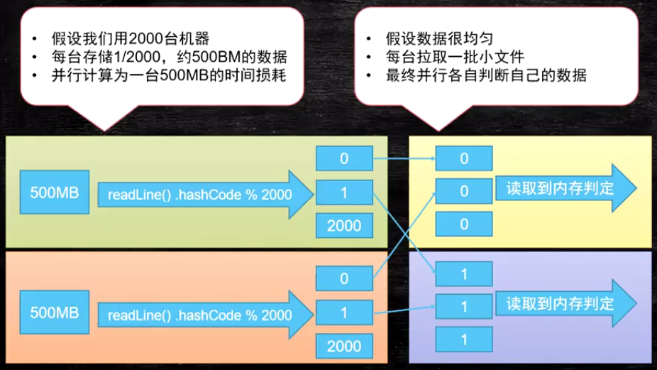
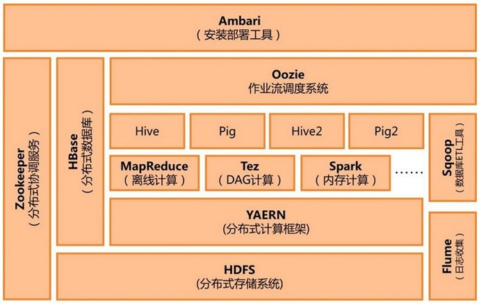
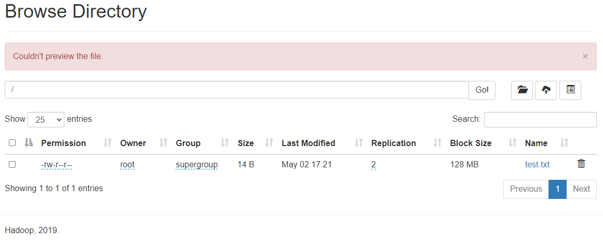
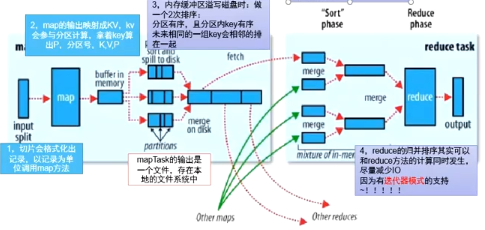

# 一、Hadoop

## 前言

> #### 分治思想
>
> 需求：
>
> - 一万个元素需要存储（数字、单词）
>
> - 查找某一个元素的复杂度

 

> - **期望复杂度O(4)**

 


> #### 单机处理大数据问题
>
> 需求：
>
> - 一个很大的文本文件，只有两行一样，需要找出它们的位置
> - 单机且可用内存很少，几十M
> - 假设磁盘读取（IO）速度500M每秒，1T文件读取需30分钟，需要N次IO时间
> - 如何让文件处理时间变为分钟、秒级别

 

> - 单机条件下，持续读取大文件，按照hash取模将读取数据分散到2000个小文件中，之后对每份文件进行比对

 

> #### 集群分布式处理大数据

 

> - 2000台机器并行读取 -> 2000台机器并行拉去相同文件（耗时） -> 2000台机器并行计算
>
>   问题：
>
>   移动数据的成本很高
>
>   计算向数据移动，不是数据向计算移动

> #### 集群与单机比较
>
> - 2000台比1台更快吗？
> - 考虑文件分发上传时间
> - 如果每天1T数据产生
> - 计算增量一年后的数据

> #### 结论
>
> - 分而治之
> - 并行计算
> - 计算向数据移动
> - 数据本地化读取

## 什么是大数据

从字面意思上来看，”大数据”可以分为两个方面来看。首先是”大”，是指数据的规模非常庞大，远远超出了普通存储介质或单机的存储量。其次是”数据”，数据可以是任意类型的，无论是结构化数据还是非结构化数据，无论是日志、聊天记录、上网记录还是交易信息和各种传感器的信息等。我们要学习的技术，就是针对这些不同种类的海量数据进行收集、存储、分析等。

网上对于大数据的定义更为详细，基本上可以分为四个方面，也就是所谓的大数据的4V：

- 海量（Volume）
- 多样（Variety）
- 速度（Velocity）
- 价值（Value）

其中海量和多样，就是我们刚才介绍的数据类型繁多，数据量巨大。速度是指对于海量数据的处理或计算性能的要求，举个例子来说，我们在淘宝、京东进行购物，系统会根据我们的商品浏览记录实时进行商品推荐；大型游戏的服务器会对玩家的操作进行实时监控，以判断玩家是否使用了外挂。价值是指如何从海量价值密度低的数据中提取我们所需更加有意义的数据，并不是所有的数据都是有价值的，我们需要对数据进行进一步的清洗、提纯，加之特定的挖掘，才能够得到符合需求的有价值的数据。

我们无时无刻不在生产着各种数据，无论是网页浏览、微信QQ聊天，或者网络购物、买票，或者出行、住宿，甚至是出入任何公共场合、驾车、水电。同时我们也在消费着其他人生产的数据，我们使用的各种电子产品，每一个设计细节都融入了设计者对用户体验数据的调查与分析。无论我们愿意还是不愿意，或者有没有意识到，我们现在已经处于大数据的时代了。

 

## Hadoop 介绍

### 介绍

1. Hadoop能够以一种简单计算模型的方式在多台节点上分布式处理超大规模的数据集。
2. 由Apach基金会开发的分布式系统基础架构。
3. Hadoop 通常指 Hadoop 生态圈
4. Hadoop解决了大数据领域中**`数据存储`**和**`数据计算`**两个方面问题。

Hadoop有以下几个重要的模块：

- `Hadoop Common`，用于支撑其他模块的公共模块，提供了RPC请求、数据序列化等公共服务
- `Hadoop Distributed File System(HDFS)`，提供了高吞吐量的分布式文件系统，解决了数据存储的问题
- `Hadoop YARN`，负责任务调度和集群资源管理的框架，解决了分布式任务中资源分配的问题
- `Hadoop MapReduce`，一个基于YARN的用于并行处理大规模数据集的框架，解决了数据计算的问题 

------

### 发展历史

1. Lucence 全文检索框架作者  Doug Cutting，使用 Java 编写，实现与 Google 类似的全文搜索功能。

    

2. 2001年年底Lucence成为 Apache 子项目。

3. 海量数据场景，Lucence 存储数据困难，检索速度慢。

4. 模仿 Google 开发 微型版 Nutch。

5. Google 三篇论文

   GFS -> HDFS

   Map-Reduce -> MR

   BigTable -> HBase

6. 2003-2004年，Google公开 GFS 与 MapReduce 思想细节，以此为基础 Doug Cutting 用 2年 实现 DFS 与 MapReduce 机制，使 Nutch 性能提升。

7. 2005 年 Hadoop 作为 Lucene 的子项目 Nutch 的一部分正式引入 Apach 基金会。

8. 2006年 3月， Map-Reduce 和 Nutch Distributed File System（NDFS）分别纳入 Hadoop 项目中，Hadoop 正式登场，大数据时代来临。

------

### Hadoop 三大发行版

Hadoop三大发行版本：**Apache**、**Cloudera**、**Hortonworks**。

Apache版本最原始（最基础）的版本，对于入门学习最好。

Cloudera内部集成了很多大数据框架。对应产品CDH。

Hortonworks文档较好。对应产品HDP。

> ####  **1）Apache Hadoop**
>
> 官网地址：http://hadoop.apache.org/releases.html
>
> 下载地址：https://archive.apache.org/dist/hadoop/common/

> #### **2）Cloudera Hadoop** 
>
> 官网地址：https://www.cloudera.com/downloads/cdh/5-10-0.html
>
> 下载地址：http://archive-primary.cloudera.com/cdh5/cdh/5/
>
> （1）2008年成立的Cloudera是最早将Hadoop商用的公司，为合作伙伴提供Hadoop的商用解决方案，主要是包括支持、咨询服务、培训。
>
> （2）2009年**Hadoop**的创始人Doug Cutting也加盟Cloudera公司。Cloudera产品主要为CDH，Cloudera Manager，Cloudera Support
>
> （3）CDH是Cloudera的Hadoop发行版，完全开源，比Apache Hadoop在兼容性，安全性，稳定性上有所增强。Cloudera的标价为每年每个节点10000美元。
>
> （4）Cloudera Manager是集群的软件分发及管理监控平台，可以在几个小时内部署好一个Hadoop集群，并对集群的节点及服务进行实时监控。
>
> （5）目前 Cloudera 已合并 CDH 与 HDP，推出 CDP 总共引入三十多个开源组件，这些组件构成了 CDP 的五大模块：
>
> > 数据仓库（CDW，Cloudera Data Warehouse）。计算引擎包括 Hive、Impala 等。
> > 机器学习（CML - Cloudera Machine Learning）。Spark 也是机器学习的利器。CDP 集成了 Spark 3.0 的 RAPIDS 加速器，加速数据管道并大幅提升数据和机器学习工作流。
> > 数据工程（CDE，Cloudera Data Engineering）。主要包括 Spark 等在数据工程方面能力很强的组件。其中 Spark 是 Cloudera 的重点项目，但在方向上会做一些调整。
> > 数据流式处理（CDF，Cloudera Data Flow）。主要包括 Kafka 来保证数据加工传输，Flink 做流式数据计算，Nifi 在边缘（Edge）节点上做加工处理。
> > 操作型数据库（COD，Cloudera Operational Database）。主要是 HBase 负责历史数据海量存储和查询。目前 HBase 版本已更新至 2.2，支持 Phoenix 二级索引等功能。

> #### **3）Hortonworks Hadoop**
>
> 官网地址：https://hortonworks.com/products/data-center/hdp/
>
> 下载地址：https://hortonworks.com/downloads/#data-platform
>
> （1）2011年成立的Hortonworks是雅虎与硅谷风投公司Benchmark Capital合资组建。
>
> （2）公司成立之初就吸纳了大约**25名至30**名专门研究**Hadoop的雅虎工程师，上述工程师均在2005年开始协助雅虎开发**Hadoop，贡献了Hadoop80%的代码。
>
> （3）Hortonworks的主打产品是Hortonworks Data Platform（HDP），也同样是100%开源的产品，HDP除常见的项目外还包括了**Ambari**，一款开源的安装和管理系统。
>
> （4）Hortonworks目前**已经被Cloudera公司收购**。

------

### Hadoop 优势

1.  高可靠性：多副本，防止数据丢失
2. 高扩展性：集群节点扩展
3. 高效性：MapReduce并行计算
4. 高容错性：失败任务自动重新分配

------

### Hadoop 生态圈 

 

下面是与Hadoop相关的一些Apache项目：

- **`HDFS`**，分布式文件系统
  - ZKFC：为实现NameNode高可用，在NameNode和Zookeeper之间传递信息，选举主节点工具。
  - NameNode：存储文件元数据
  - DateNode：存储具体数据
  - JournalNode：同步主NameNode节点数据到从节点NameNode
- **`MapReduce`**，开源的分布式批处理计算框架
- **`Yarn`**，调度资源管理器
- **`Ambari`**，一个基于Web的工具，用于管理、监控Hadoop集群以及其他组件，包括了Hadoop HDFS、Hadoop MapReduce、Hive、HCatalog、HBase、ZooKeeper、Oozie、Pig以及Sqoop等。Ambari也提供了用于查看集群的运行情况的仪表盘，例如热点图和能够直观的查看MapReuce、Pig和Hive应用程序以及以用户友好的方式诊断其性能特征的功能
- **`Avro`**，一个数据序列化系统
- **`Cassandra`**，一个可扩展的多个主节点数据库，没有单点故障
- **`Chukwa`**，一个用于管理大型分布式系统的数据收集系统
- **`HBase`**，一个可扩展的分布式数据库，支持大表的结构化数据存储
- **`Hive`**，一个数据仓库基础组件，提供数据汇总和即席查询
- **`Mahout`**，一个可扩展的机器学习和数据挖引擎
- **`Pig`**，用于并行计算的高级数据流和执行框架
- **`Spark`**，一个适用于Hadoop的快速和通用计算引擎，Spark提供了一种简单而富有表现力的编程模型，支持广泛的应用程序，包括ETL、机器学习、流处理和图计算
- **`Flink`**，流批一体 **`实时`** 计算框架
- **`Tez`**，一个基于Hadoop YARN的通用数据流编程框架，提供了一个强大而灵活的引擎来执行任意DAG任务来处理批处理和交互式用例的数据。Tez正在被Hadoop生态系统中的Hive、Pig和其他框架采用，也被其他商业软件（如ETL工具）采用，以取代Hadoop MapReduce作为底层执行引擎
- **`ZooKeeper`**，个用于分布式应用的高性能协调服务
- **`Impala`**，是Cloudra公司开发的一个查询系统，类似于Hive，可以通过SQL执行任务，但是它不基于MapReduce算法，而是直接执行分布式计算，这样就提高了效率。
- **`Sqoop`**，将hadoop和关系型数据库互相转移的工具。
- **`Flume`**，采集日志 

下面是按照框架分类：

- **日志收集框架**：Flume、Logstash、Filebeat
- **分布式文件存储系统**：Hadoop HDFS
- **数据库系统**：Mongodb、HBase
- **分布式计算框架**：
- - 批处理框架：Hadoop MapReduce
  - 流处理框架：Storm
  - 混合处理框架：Spark、Flink
- **查询分析框架**：Hive 、Spark SQL 、Flink SQL、 Pig、Phoenix
- **集群资源管理器**：Hadoop YARN
- **分布式协调服务**：Zookeeper
- **数据迁移工具**：Sqoop
- **任务调度框架**：Azkaban、Oozie
- **集群部署和监控**：Ambari、Cloudera Manager

 

分层描述：

  

### Hadoop 1.X 与 2.X 区别

 

------


## hadoop-hdfs 分布式文件系统

> ### 问题：
>
> 为何 hadoop 项目要开发一个分布式文件系统？
>
> 与其他分布式文件系统的区别？

------

### 前言

1. HDFS的全称是 `Hadoop Distributed File System` ， 是hadoop的核心组件之一，提供了**分布式存储服务**。

2. HDFS 解决了**大数据领域的数据存储问题**。当存储规模达到一定程度时，只需要增加节点，就可以实现扩容。

3. 对于客户端而言，**访问HDFS**就像是**访问普通的文件系统**一样，不需要关心背后的实现。

4. 适合**一次写入，多次读出**的场景，**不支持文件修改**。适用于数据分析。

    

------

### HDFS 设计

HDFS以流式数据访问模式来存储超大文件，运行于商用硬件集群上。

- `超大文件`，这里指具有几百MB、几百GB甚至几百TB大小的文件。
- `流式数据访问`，HDFS的构建思路是这样的：一次写入、多次读取是最高效的访问模式。数据集通常由数据源生成或从数据源复制而来，接着长时间在此数据集上进行各种分析。每次分析都将涉及该数据集的大部分数据甚至全部，因此读取整个数据集的时间延迟比读取第一条记录的时间延迟更重要。
- `商用硬件`，Hadoop不需要运行在昂贵的高可靠硬件上。它是设计运行在商用硬件（很好买到的普通硬件）的集群上的，因此至少对于庞大的集群来说，节点故障的几率还是非常高的。HDFS遇到上述故障时，被设计成能够继续运行且不让用户察觉到明显的中断。
- `低时间延迟的数据访问`，要求低时间延迟数据访问的应用，例如几十毫秒范围，不适合在HDFS上运行。记住，HDFS是为高数据吞吐量应用优化的，这可能会提高时间延迟为代价。目前，对于低延迟的访问需求，HBase是更好的选择。
- `大量的小文件`，由于NameNode将文件系统的元数据存储在内存中，因此该文件系统所能存储的文件总数受限于NameNode的内存容量。根据经验，每个文件、目录和数据块的存储信息大约占150字节。因此，举例来说，如果有一百万个文件，且每个文件占一个数据块，那么至少需要300MB的内存。
- `多用户写入，任意修改文件`，HDFS中的文件写入只支持单个写入者，而且写操作总是以追加的方式在文件末尾写数据。它不支持多个写入者操作，也不支持在文件的任意位置进行修改。

------

### HDFS 优缺点

#### 优点

1. 高容错性

   （1）数据自动保存多个副本。它通过增加副本的形式，提高容错性。

    

   （2）某一个副本丢失以后，它可以自动恢复。

    

2. 适合处理大数据

   （1）数据规模：能够处理数据规模达到GB、TB、甚至PB级别的数据；

   （2）文件规模：能够处理百万规模以上的文件数量，数量相当之大。

3. 可构建在廉价机器上，通过多副本机制，提高可靠性。

#### 缺点

1. 不适合低延时数据访问，比如毫秒级的存储数据，是做不到的。

2. 无法高效的对大量小文件进行存储。

   （1）存储大量小文件的话，它会占用NameNode大量的内存来存储文件目录和块信息。这样是不可取的，因为NameNode的内存总是有限的；

   （2）小文件存储的寻址时间会超过读取时间，它违反了HDFS的设计目标。

3. 不支持并发写入、文件随机修改。

   （1）一个文件只能有一个写，不允许多个线程同时写；

    

   （2）仅支持数据append（追加），不支持文件的随机修改。

------

### HDFS 组成架构

- 主从架构（Master/Slaver)

- > **一个 NameNode**（主 **nn**）、一些**备用 Secondary NameNode **（备 **2nn**）、 **一些 DataNode**（从 **dn**）、客户端 **Client**
  >
  >  

- > **`NameNode（nn）`**节点即主管，**Master**，负责集群的文件元数据管理（文件目录树）
  >
  > 1）管理HDFS的名称空间；
  >
  > 2）配置副本策略；
  >
  > 3）管理数据块（Block）映射信息；
  >
  > 4）处理客户端读写请求；

- > **`DataNode（dn）`**节点即工人，**Slaver**，负责具体的数据存储（**bolck 块**）
  >
  > 1）存储实际的数据块；
  >
  > 2）执行数据块的读写操作；

- > **`Client`** 即客户端
  >
  > （1）文件切分。文件上传HDFS的时候，Client将文件切分成一个一个的Block，然后进行上传；
  >
  > （2）与NameNode交互，获取文件的位置信息；
  >
  > （3）与DataNode交互，读取或者写入数据；
  >
  > （4）Client提供一些命令来管理HDFS，比如NameNode格式化；
  >
  > （5）Client可以通过一些命令来访问HDFS，比如对HDFS增删查改操作；

- > **`Secondary NameNode`** 并非NameNode的热备。当NameNode挂掉的时候，它并不能马上替换NameNode并提供服务。
  >
  > （1）辅助NameNode，分担其工作量，比如定期合并Fsimage和Edits，并推送给NameNode ；
  >
  > （2）在紧急情况下，可辅助恢复NameNode。

- > 官网架构图
  >
  >  

### HDFS 文件块大小

1. **HDFS**中的文件在物理上是分块存储（Block），块的大小可以通过配置参数( dfs.blocksize)来规定，默认大小在Hadoop2.x版本中是**128M**，老版本中是64M。

   （1）如果寻址时间约为10ms，即查找到目标block的时间为10ms。

   （2）寻址时间为传输时间的1%时，则为最佳状态。因此，传输时间=10ms/0.01=1000ms=1s。

   （3）目前磁盘的传输速率普遍为100MB/s。

   （4）block大小=1s*100MB/s=100MB。

2. 为何 **HDFS** 块大小设置为 磁盘1秒 IO 的数据量

   （1）HDFS的块设置太小，会增加寻址时间，程序一直在找块的开始位置；

   （2）如果块设置的太大，从磁盘传输数据的时间会明显大于定位这个块开始位置所需的时间。导致程序在处理这块数据时，会非常慢。

3. **HDFS**块的大小设置主要**取决于磁盘传输速率。**

### HDFS 文件读写原理

Client（客户端）对HDFS中的数据进行读写操作，分别是Client从HDFS中查找数据，即为Read（读）数据；Client从HDFS中存储数据，即为Write（写）数据。下面我们对HDFS的读写流程进行详细的介绍。假设有一个文件1.txt文件，大小为300M，这样就划分出3个数据块，如图1所示。

 

#### HDFS写数据原理

 

（1） 客户端发起文件上传请求，通过RPC（远程过程调用）与NameNode建立通讯。

（2） NameNode检查元数据文件的系统目录树。

（3） 若系统目录树的父目录不存在该文件相关信息，返回客户端可以上传文件。

（4） 客户端请求上传第一个Block数据块，以及数据块副本的数量（可以自定义副本数量，也可以使用集群规划的副本数量）。

（5） NameNode检测元数据文件中DataNode信息池，找到可用的数据节点（DataNode_01，DataNode_02，DataNode_03）。

（6） 将可用的数据节点的IP地址返回给客户端。

（7） 客户端请求3台节点中的一台服务器DataNode_01，进行传送数据（本质上是一个RPC调用，建立管道Pipeline），DataNode_01收到请求会继续调用服务器DataNode_02，然后服务器DataNode_02调用服务器DataNode_03。

（8） DataNode之间建立Pipeline后，逐个返回建立完毕信息。

（9） 客户端与DataNode建立数据传输流，开始发送数据包（数据是以数据包形式进行发送）。

（10） 客户端向DataNode_01上传第一个Block数据块，是以Packet为单位（默认64K），发送数据块。当DataNode_01收到一个Packet就会传给DataNode_02，DataNode_02传给DataNode_03； DataNode_01每传送一个Packet都会放入一个应答队列等待应答。

（11） 数据被分割成一个个Packet数据包在Pipeline上依次传输，而在Pipeline反方向上，将逐个发送Ack（命令正确应答），最终由Pipeline中第一个DataNode节点DataNode_01将Pipeline的 Ack信息发送给客户端。

（12） DataNode返回给客户端，第一个Block块传输完成。客户端则会再次请求NameNode上传第二个Block块和第三块到服务器上，重复上面的步骤，直到3个Block都上传完毕。

#### HDFS读数据原理

 

（1） 客户端向NameNode发起RPC请求，来获取请求文件Block数据块所在的位置。

（2） NameNode检测元数据文件，会视情况返回Block块信息或者全部Block块信息，对于每个Block块，NameNode都会返回含有该Block副本的DataNode地址。

（3） 客户端会选取排序靠前的DataNode来依次读取Block块（如果客户端本身就是DataNode，那么将从本地直接获取数据），每一个Block都会进行CheckSum（完整性验证），若文件不完整，则客户端会继续向NameNode获取下一批的Block列表，直到验证读取出来文件是完整的，则Block读取完毕。

（4） 客户端会把最终读取出来所有的Block块合并成一个完整的最终文件（例如：1.txt）。


#### HDFS 界面

 

##### 类 linux/unix 文件系统

| Permission | Owner | Group      | Size | Last Modified | Replication | Block Size | Name     |
| ---------- | ----- | ---------- | ---- | ------------- | ----------- | ---------- | -------- |
| -rw-r--r-- | root  | supergroup | 14 B | May 02 17:21  | 2           | 128 MB     | test.txt |
|            |       |            |      |               |             |            |          |
|            |       |            |      |               |             |            |          |

##### 文件上传执行命令

```
hdfs dfs -put test.txt /
```

hdfs 有对应 用户/用户组/权限， 其默认依据 连接客户端所属 用户/用户组/权限 创建文件（hdfs 无创建用户、权限的接口）

有超级用户概念

​		linux 超级用户：root

​        hdfs 超级用户：namenode进程的启动用户

hdfs 文件系统权限由 hdfs 自己控制， 控制使用 hdfs 超级用户


实操：

切换用 root 搭建的 hdfs，  用 god 用户来启动


h01 ~ h03：

​	1）添加用户：hadoop

​							useradd	hadoop

​							useradd	hadoop

​	2）将资源与用户绑定（a，安装部署程序；b，数据存放的目录）

​			chown -R hadoop src

​	3）切换到 hadoop 启动 start-dfs.sh	<	需要 ssh 免密

​			给 hadoop 做免密


##### 文件分割上传

```
docker cp 
docker exec -it h01 /bin/bash
./hdfs dfs -D dfs.blocksize=1048576 -put /home/dpcq.txt /shx/
```


## MapReduce 原理

什么叫 Map、Reduce

一进N出

 

### MapReduce过程

block 块、切片、并行度，reeduce task（分区） 数量由人定义

 

### MapReduce过程（详细）

 

### MapReduce备注

 


- 文件包含：文件数据（**data**）和文件元数据（**metadata**）
- DataNode 与 NameNode 维持**心跳**，并**汇报**自己持有的 **block** 消息
- **client** 与 NameNode 交互 **元信息**， 与 DataNode 交互 **block** 数据 

- > 官网架构图
  >
  >   


 


 


## 为什么需要Hadoop 


##　Hadoop与其他分布式文件系统区别


## 主要解决的问题


## 大体结构


## Hadoop集群快速搭建（基于虚拟机）

本地运行 hadoop 问题

1. 设置 hadoop.home.dir

   ```
   System.setProperty("hadoop.home.dir", "G:\\hadoop-3.2.2");
   ```

2. 设置

   ```
   winutils.exe 放到 hadoop bin目录下
   ```

3. access报错

   粘贴源码 org.apache.hadoop.io.nativeio.NativeIO 类，重写 access 方法

   ```
   public static boolean access(String path, AccessRight desiredAccess)
   throws IOException {
   //            return access0(path, desiredAccess.accessRight());
   	return true;
   }
   ```


## 提交 MapReduce 程序到集群并运行

1. mvn -package 打包程序 hadoop-test-1.0-SNAPSHOT

2. 上传到服务器

3. 提交 MapReduce 作业

   基本命令

   > ##### hadoop	jar	{jarFile}	[mainClass]	args
   >
   > ​	-jarFile: MapReduce 运行程序jar包
   >
   > ​	-mainClass：jar包中main函数所在类类名
   >
   > ​	-args：程序调用需要的参数【输入输出路径】

   ```
   进入 hadoop 目录中执行：
   cd /home/hadoop/app/hadoop-3.2.2
   
   执行作业：
   bin/hadoop jar hadoop-test-1.0-SNAPSHOT.jar sos.haruhi.hadoop.WordCount /text/hadoop-hadoop-datanode-hadoop01.log /text/output1
   
   执行作业：
   bin/hadoop jar hadoop-test-2.0-SNAPSHOT.jar wordcount /text/hadoop-hadoop-datanode-hadoop01.log /text/output2
   ```

   | bin/hadoop     | jar  | hadoop-test-1.0-SNAPSHOT.jar | sos.haruhi.hadoop.WordCount | /text/hadoop-hadoop-datanode-hadoop01.log | /text/output1 |
   | -------------- | ---- | ---------------------------- | --------------------------- | ----------------------------------------- | ------------- |
   | hadoop执行文件 | jar  | 项目jar名称                  | main方法所在类              | 输入文件在hadoop中路径                    | 输出文件路径  |

4. 查看执行结果

   ```
   bin/hdfs dfs -cat /text/output1/*
   ```

   